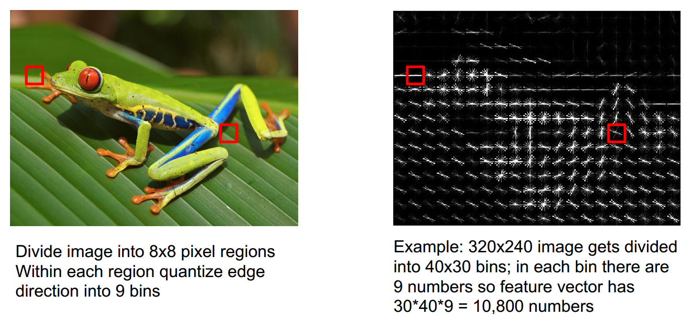
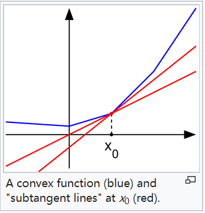
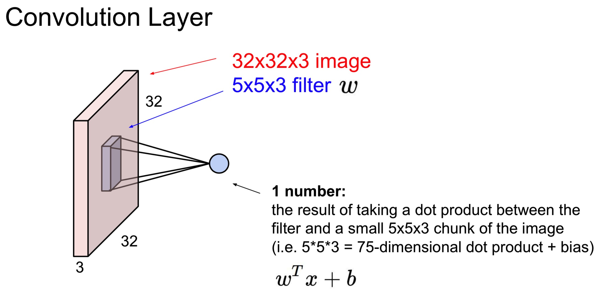
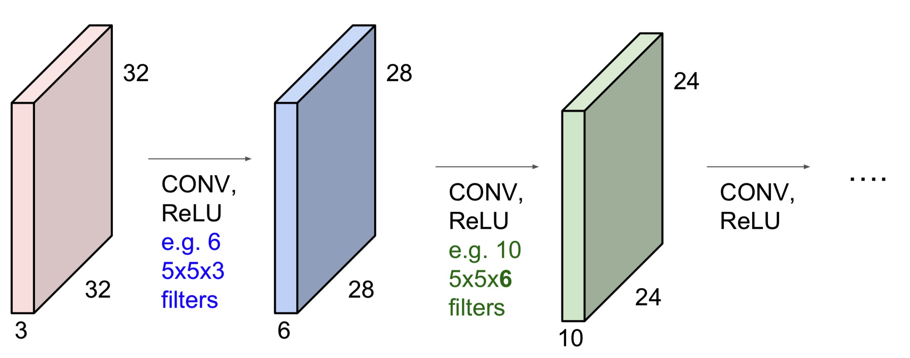

上学期其实已经把assignment1 和 2做完了，但是那是基于python2，这学期cs231n又更新到2018版，作业也使用了python3.6，我就想着复习一下基础知识，顺便再做一遍这个作业。

下面是作业1之前部分的slides 和 notes的笔记

### Linear Classfier

我们有一些数据 (x,y),有一个 score function:
$$
s = f(x;W)=Wx
$$
有一个损失函数：

* softmax:

$$
L_i = -log(\frac{e^{s_{y_i}}}{\sum_j e^{s_j}})
$$

* SVM:

$$
L_i = \sum_{j\neq y_i} max(0, s_j+1-s_{y_i})
$$

* Full loss:

$$
L = \frac{1}{N} \sum_{i=1}^N L_i + \lambda R(W)
$$

### Optimization

用SGD（随机梯度下降），每次选取一个minibatch 训练
$$
\nabla_W L(W) = \frac{1}{N} \sum_{i=1}^N \nabla_W L_i(x_i,y_i,W) + \lambda \nabla_W R(W)
$$
除了线性分类器之外，还有很多提取特征的方法，比如用 color histogram(颜色直方图)，Histogram of Oriented Gradients(方向梯度直方图)

对于连续可微的凸函数，我们可以很容易的得出它的导数，从而进行梯度下降，但是对于比如在 SVM 中的 max 函数，它虽然也是凸函数，但是它在某些点上无法求导，比如函数
$$
y = max(x, 0)
$$
它在x=0处是无法求导的，那我们如何在该点梯度下降呢？虽然它不可求导，但是它可以求 subderivative:

[subderivative的定义](https://en.wikipedia.org/wiki/Subderivative)

那么它沿着负的 subderivative 的方向仍然是可以降低loss的，如下图所示

我们对 SVM 求导
$$
L_i = \sum_{j \neq y_i }\left[ max (0, w_j^Tx_i-w_{y_i}^Tx_i + \triangle) \right]
$$

$$
\nabla_{w_{y_i}} L_i  = -\left(\sum_{j\neq y_i} 1(w_j^Tx_i-w_{y_i}^Tx_i + \triangle > 0) \right) x_i
$$

$$
\nabla_{w_{j}} L_i  =  1(w_j^Tx_i-w_{y_i}^Tx_i + \triangle > 0)  x_i
$$

### Convolutional neural

上图 5x5x3的 filter 是一个卷积核，可以同时存在多个卷积核，它们分别作用于原图像，生成数层激活层。

ConvNet是一个卷积层序列，在每一层的最后会有一个激活函数

使用卷积可以大大减少网络的参数

我们可以把卷积操作转化成**矩阵乘法**，输入图像中的局部区域被拉伸成列，我们称之为im2col，比如输入是[227x227x3]，我们使用stride=4，11x11x3的filter，我们可以对输入中的一块[11x11x3]的像素块拉伸成列，也就是11\*11\*3=363，我们沿着输入的长和宽不断做这个操作，最终生成55x55=3025个列，所以我们得到了[363x3025]的X_col，如果我们有96个filter，那么我们会得到[96x363]的W_row，那么在这层卷积就等同于做np.dot(W_row, X_col)，得出一个 [96x3025] 的矩阵，这个结果需要reshape一下变成 [55x55x96]，那么这就是最后卷积的结果。

这个方法有一个缺点就是使用了较多的存储空间，因为在输入中的一些像素值由于卷积的overlap，会多次出现在 X_col 中。优点是有很多高效的矩阵乘法的工具可以利用。

池化层：

池化简化特征表示并且减少了参数的个数和网络的计算量，通常采用最大池化和平均池化，通常使用一个 2x2 stride=2 的filter。

对池化层方向传播：在前向传播中我们只需要记住每一块中最大的那个值的index，在这个值上导数为1，其他为0。

然而很多研究表明，pooling是可以被替代的，比如我们可以用更大 stride 的卷积层，而丢掉 pooling 在训练生成式模型是很有用的，比如 变分自编码器，GANs。

**FC 层 与卷积层相互转换**：

考虑我们的卷积层和，FC 层的大小都是固定的，训练时是给定图像的大小，而如果测试的图像分辨率比训练的图像大，那么这就无法直接应用这个网络了，当然我们可以缩小这个图像的分辨率至和训练图像的分辨率相同，但是我们还有另外一种方法，我们可以把 FC 层替换成卷积层。

在最后一层卷积层之后我们需要讲它拉伸为 FC 层，那么之后才能连接到下一层，我们可以略去这一步，比如最后一层卷积层是 [7x7x512]，我们可以选取 4096 个 [7x7x512] 的 filter， 那么输出的就是[1x1x4096]，这就将 FC 层转换为 卷积层。

比如我们训练输入的是 [224x224x3] 的图像，我们经历过卷积和5层 pooling 之后，变成 [7x7x512] 的卷积层（224/2/2/2/2/2），现在若测试输入图像是[384x384x3]，那么经过卷积和池化后，输出 [12x12x512] 的卷积层，我们依然使用 4096个[7x7x512]的filter，那么输出的就是 [6x6x4096]，若是一个十分类任务，最后输出 [6x6x10]，我们对 每个6x6 取均值得到的就是这个类上的评分，这也是非常合理的方法。

### 卷积层架构

通常是由：

构成卷积层。

通常 0<=N<=3，M>=0， 0<=K<3

相对于filter 大的少层的网络，通常我们更青睐于filter小的多层的网络，这样可以增加更多的非线性特征，并且也有着更少的参数。

在卷积层中我们通常使用 stride 1，通常小的 stride 可以表现的更好。我们也使用0-padding，这样可以使得边界上的信息不会减少的太快。

