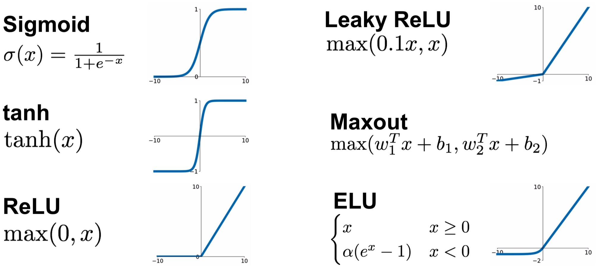
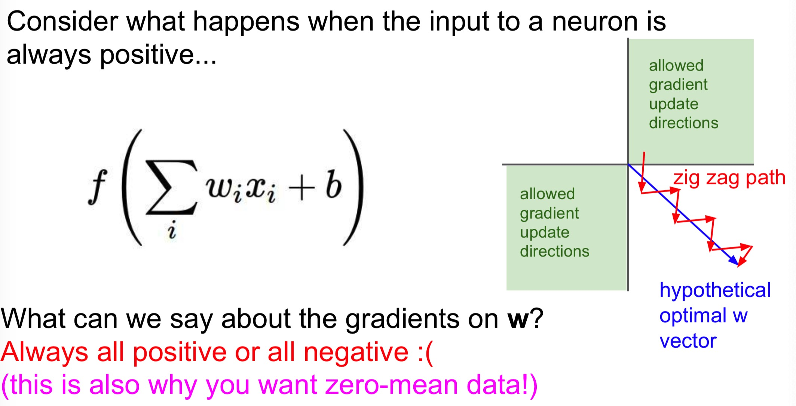
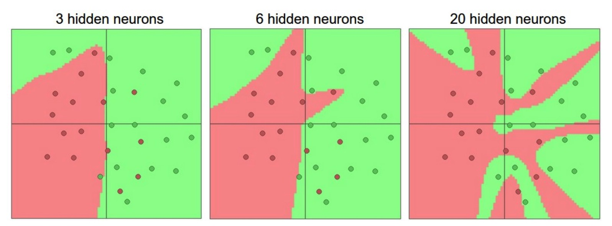
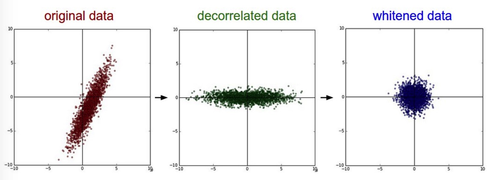
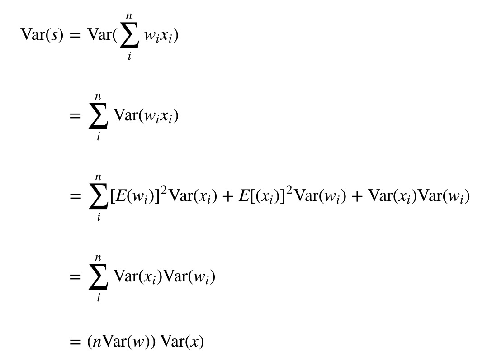
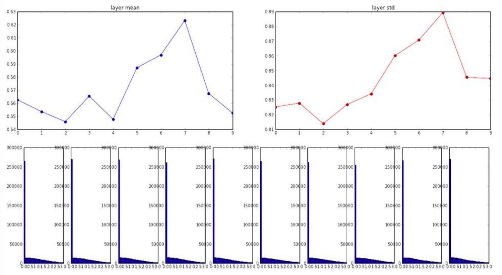
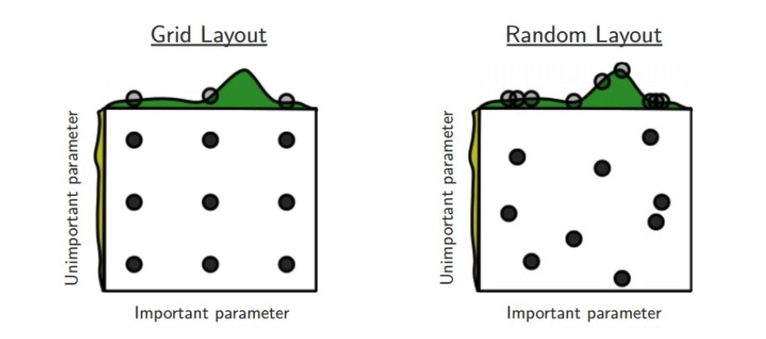

## 训练神经网络part1

### 激活函数



#### Sigmoid

* 将输入压缩至[0,1]

* 三个问题：

  * 饱和神经元会杀死梯度
  * 输出不是 0-centered，这样会导致梯度是恒正或恒负

  

  * exp() 计算量大

#### ReLU（Rectified Linear Unit）

* 不饱和
* 计算量小
* 实际中收敛快
* 实际比sigmoid 更具有生物上的可行性
* 非 0-centered 输出
* ReLU 单元可能会永久性失活（非可逆性）

#### Leaky ReLU

* 不饱和
* 计算量小
* 收敛快
* 不会失活

#### Exponential Linear Units(ELU)

* 所有ReLU 的优点
* 接近 0 均值输出
* 与 Leaky ReLu 相比具有负饱和机制，增加了一些鲁棒性

#### Maxout Neuron

* 整合了 ReLU 和 Leaky ReLU
* 线性机制，不会饱和，不会失活
* 加倍了神经元（参数）

#### 实际使用

* 使用 ReLU，需要注意学习率
* 尝试 Leaky ReLU/Maxout/ELU
* 尝试 tanh 但不要期望太高
* 不要使用 sigmoid


### 神经网络的表现力

可以被证明，给定任何连续函数 $f(x)$ 和 $\epsilon >0$ ，必存在一个具有一个隐藏层的神经网络 $g(x)$ ，使得 $\forall x, |f(x) - g(x)|<\epsilon$，也就是说神经网络可以逼近任何连续函数（直观的解释参见 [Michel Nielsen](http://neuralnetworksanddeeplearning.com/chap4.html))。

既然具有一个隐藏层的神经网络已经可以逼近任意网络了，那么我们为什么还要使用更深的层呢？深层网络比单隐藏层网络表现的好的 事实是一个经验观察，尽管它们的表现力都是一样的。

尽管3层神经网络比2层表现的好，但是再深下去往往效果就没那么好了，这与CNN 不同，深度是一个好的识别系统的重要组成。

具有更多神经元的神经网络可以表达更复杂的函数，这一个双刃剑，可能会导致过拟合，我们可以使用一些正则化方法来减小过拟合。但是我们还是不要使用小网络，因为小的网络往往有相对少的局部最优点，它们容易收敛到局部最优，相反的，大网络具有更多的局部最优，而这些局部最优往往是更好的。如果你训练一个小网络，最终的loss 会具有较大的方差——在一些情况下你足够幸运并收敛到一个好的位置，而在别的情况你就被困在一个坏的局部最优。而如果你训练一个大网络，最终的loss 的方差就会小的多，也就是所有的solutions 都平均好，很少依赖于随机初始化。



### 数据预处理

#### 减均值

对数据的每一个单独的特征减它们的均值：

```python
x -= np.mean(X, axis=0)
```

为了简便常见的也有减去一个来自所有像素的均值。

```python
x -= np.mean(X)
```

或者也可以分别对三个色彩通道操作

#### Normalization

标准化每个维度上的数据使得它们大致是在一个范围区间内，通常有两种标准化方法。

* 对已经 0-centered 的数据，对每个维度除以它的标准差

```python
X /= np.std(X, axis=0)
```

* 另一种方法标准化使得每个维度最小值和最大值分别为 -1 和 1，如果你认为每个输入特征对学习算法都有同等的重要性，那么这种标准化是有意义的，在图像中因为每个像素都是 [0,255]，所有没有必要特地的标准化。


#### PCA and Whitening

* PCA

数据先被 0-centered ，然后计算协方差矩阵，它告诉我们数据中的相关性。

```python
X -= np.mean(X, axis=0)
cov = np.dot(X.T, X) / X.shape[0]
```

然后我们对协方差矩阵做 SVD 分解

```python
U,S,V = np.linalg.svd(cov)
```

这里面 U 是标准正交特征向量（特征向量列是以它们的特征值大小来排列），S是1维特征值数组，为了给数据去相关，我们把原始数据投影到特征向量上：

```python
Xrot = np.dot(X, U)
```

这个投影可以看成是对原始数据的一个旋转，我们可以对数据降维，只用取 U 中前 k 列数据：

```python
Xrot_reduced = np.dot(X, U[:,:100])
```

于是我们将原来 NxD 维的数据降维到 Nx100，使用 PCA-降维的数据集来训练神经网络和线性分类器，往往在时间和空间上都得到改善。

* Whitening

白化操作把正交向量作为数据，并在每个维度除以特征值来标准化范围。变换的几何解释是，如果输入是多变量高斯分布，那么白化数据就是一个0均值，协方差矩阵为单位阵的高斯分布。

```python
Xwhite = Xrot / np.sqrt(S + 1e-5)
```

但是这种变换的缺点是它可能会急剧的夸大数据中的噪音，因为它延展了所有维度（包括具有小方差的不相关的维度的噪音）在输入中都具有相同的大小。



我们可以对 CIFAR-10 的图像作 SVD 分解（比较昂贵的操作）


左二是3072个特征向量的前144个，它们是数据中前144个最大的方差的特征向量，我们可以发现它们也对应了图片中最小的频率。左三是通过PCA 缩小的49个图像，这里使用了144个特征向量，为了可视化在144个特征向量中什么信息被保存了，我们需要旋转回以像素为基础的3072个数字，这可以通过乘以 U.T[:144,:]来达到，然后可视化得到的3072个数字作为图像，我们可以发现图像稍微模糊了一些，反映了最前面的特征向量捕捉了更低频，然而大部分的信息还是被保存的。

一个**陷阱**：预处理都是比如减均值，这里的均值都是从训练数据中计算得来的，对于test 和 validation 的数据都要减掉这个从训练数据中得到的均值。而如果先对整个数据计算均值然后对每个图像减去均值再将其划分为训练测试验证集将会是一个错误。

### 权重初始化

#### 全0初始化

我们不知道在训练的网络中每个权重的最后的值是多大，但是在合理的数据标准化之后，一半的权重会是正的另一半会是负的。一个看似合理的想法是初始化所有权重为0（或者为同一个数），然而其实这样是错误的，如果初始化所有权重为同一个数，那么所有权重更新都是一样的，那么所有权重不管训练了多久仍然会是相同的，这显然不合理。（如果是所有权重初始化为同一个不为0的常数，那么可以证明，除了第一层和最后一层的权重改变是不相同的，其他层的权重偏导都是一样的，证明将在另外一篇博客中展开）

#### 小随机数

我们仍想要权重非常接近于0，方法就是随机权重为初始化均值为0，单位标准差的高斯分布

```python
W = 0.01 * np.random.randn(D, H)
```

然而并非权重越小就能工作的很好，在梯度的一层层传播中，可能会出现“梯度消失”，也就是累积乘起来梯度非常非常小的情况。

#### 用 1/sqrt(n) 校正方差

从随机初始化的神经元得到的输出的方差会随着输入数量的增加而增加，推荐的做法是初始化 W 时除以 sqrt(n)，这里n 是输入的数量，这样就保证了所有初始的神经元具有相同的分布，在经验上可以改善收敛的速率。



上面我们均假设 输入和权重都是 0均值，但是这对于 ReLU 单元就不是这回事了，需要与0均值 不同的初始化，在[Delving Deep into Rectifiers: Surpassing Human-Level Performance on ImageNet Classification](http://arxiv-web3.library.cornell.edu/abs/1502.01852) 这篇论文中，对于ReLU 单元初始化

```python
W = np.random.randn(n) * sqrt(2.0/n)
```

这样通常来说效果会比较好。

#### 初始化偏置

通常偏置初始化为0，因为权重都是非常小的随机数。

#### 实际中

目前最推荐的是使用 ReLU 层并这样初始化

```python
W = np.random.randn(n) * sqrt(2.0/n)
```



详见lec06

### Batch Normalization

在非线性化层之前增加一层 BN 层，使得输出为0均值，单位方差的分布。


我们也可以让网络学习 $\gamma^{(k)}$ 和 $\beta^{(k)}$ 来恢复原来的映射。

使用 BN：

* 可以改善梯度传播
* 允许更大的学习率
* 减小对初始化的强依赖

注意在测试时，mean/std 不是在这个测试的 batch 上计算的，而是从训练中得到的一个固定的经验均值。

### 超参数优化

最重要的几个超参数：

* 初始学习率
* 学习率衰减策略
* 正则化大小（L2，dropout）

在 log 的范围上寻找超参数，一个典型的学习率采样：

```python
learning_rate = 10 ** uniform(-6, 1)
```

对于正规化大小也是类似的操作。

如果最优值出现在学习率和正规化大小的边界上，我们需要特别注意，再扩大边界看看有没有更好的结果是很重要的。

而往往随机搜索超参数会比 grid search 表现会好，在CNN的实际设置中，从仔细选择的间隔中挑选出来的很难胜过随机搜索得来的超参数。



