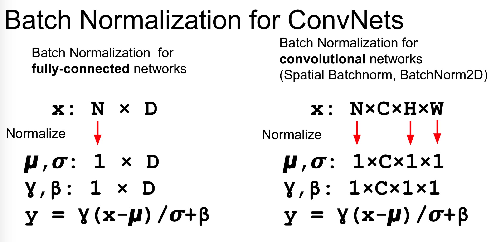
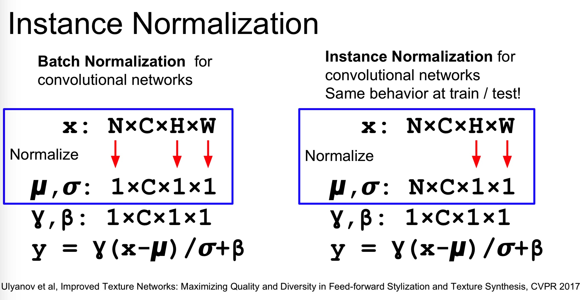
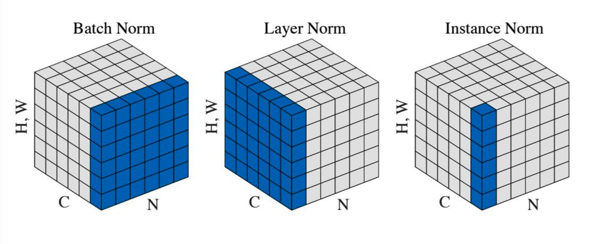
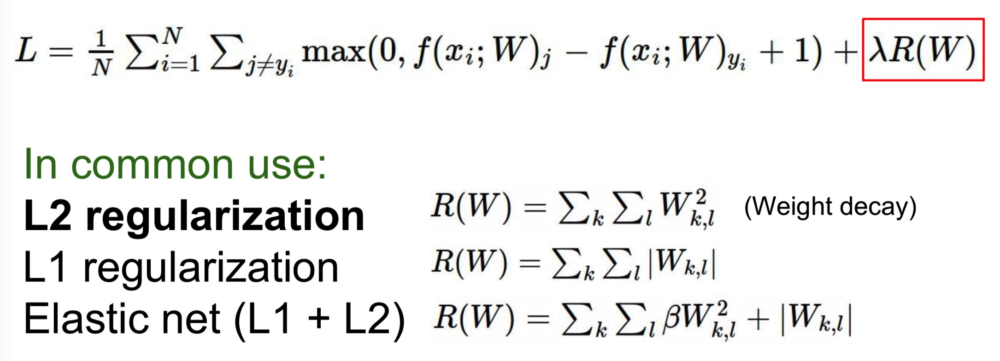
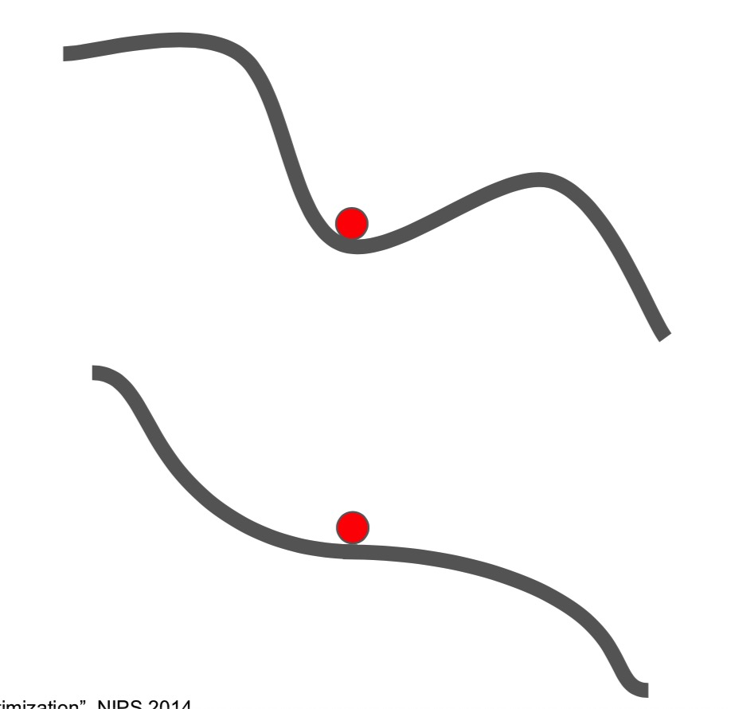
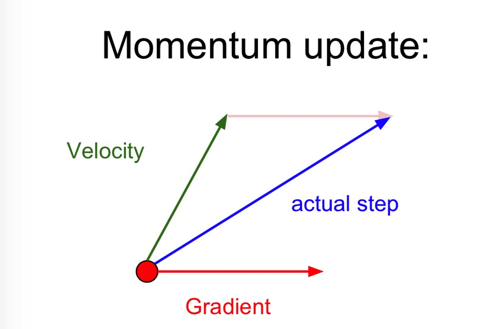
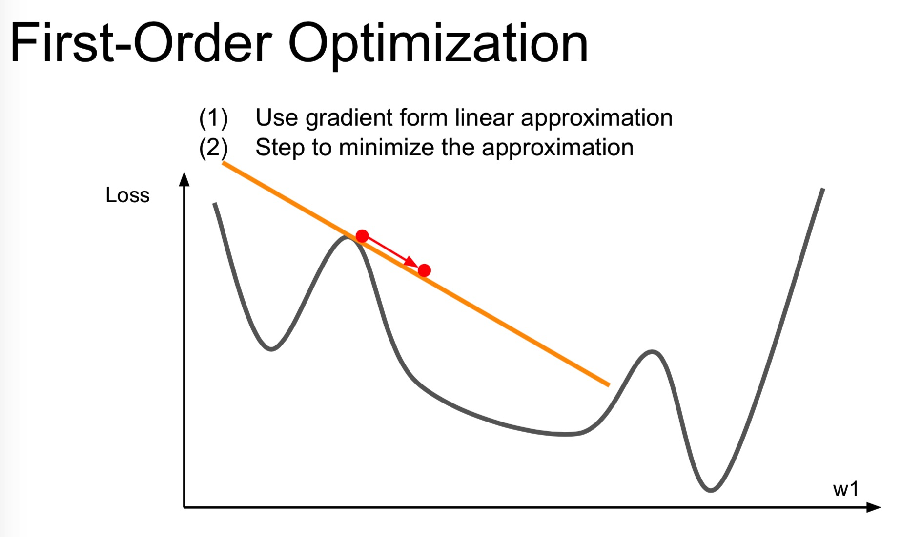
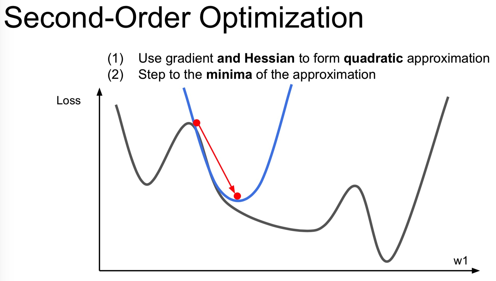

## 训练神经网络part2

在测试的时候，需要注意 $\mu_j$ 和 $\sigma_j$ 不能用测试时的数据求得，需要用训练时的数据的移动平均值


上面的是对全链接神经网络的BN层，如果是对CNN，它的每一层输出层是 NxCxHxW，在 对每个 C 通道，对N，H，W作求均值和标准差的操作



 

除了 BN 之外，对于全链接神经网络，还有一个叫做 Layer Normalization，BN 在训练和测试时的操作不一样而 LN 在训练时和测试时的操作是一样的（可能因为本身就是在特征维度上取平均和标准差）


对于 CNN 来说，除了有 BN，LN，还有 Instance Normalization





### Loss functions

令 $f=f(x_i;W)$ 是一个神经网络的输出层。

**分类** 是我们讨论比较多的，我们有一些数据集和一个单一的正确的标签集，我们通常用的两个损失函数，一个是 SVM，还有一个是 softmax。

**多特性分类** 上面我们提到的每个数据都有唯一一个 标签$y_i$ 与它对应，但如果 $y_i$ 是一个二元向量，每个数据可能有或者没有这个特性 ，而且有很多特性。比如一张社交图片，可以有很多种标签，也可能只有一个标签。那么我们通常构造一个对于每个特性独立的二元分类器
$$
L_i = \sum_j max(0, 1-y_{ij}f_j)
$$
这是对第 i 个数据求损失，这个求和是对所有分类 j 上求和，$y_{ij}$ 要么是 +1 要么是 -1。需要注意这个 loss 是累积的（也就是你无法针对某一个特性分类优化）

然而我们也可以对每个特性单独的建立分类器并训练，可以使用一个logistic regression分类器，它只有 0 和 1两类，计算 类别1 的概率是：
$$
P(y=1|x;w,b) = \frac{1}{1+e^{-(w^Tx+b)}} = \sigma(w^Tx+b)
\\
P(y=0|x;w,b) = 1 - P(y=1|x;w,b)
$$
如果一个数据被分类为正类 (y=1) 也就是 $\sigma(w^Tx+b) > 0.5$，或者也等同于 $w^Tx+b >0$.损失函数最大化似然函数，也可以写成最大化 log 似然
$$
L_i = \sum_j y_{ij} log(\sigma(f_j)) + (1-y_{ij})log(1-\sigma(f_j))
$$
然后我们可以计算它的梯度
$$
\frac{\partial L_i}{\partial f_j} = y_{ij} - \sigma(f_j)
$$
**回归**是一个预测实值的任务，通常像房价或者在一张图片中某个东西的长度啊之类的。我们通常会计算 $f$ 与 $y_i$ 之间的 L2范数或者 L1 范数。

但是 L2 回归loss 也有很多问题，它往往比一个稳定的loss比如 softmax更难优化。因为它需要非常精细的调节才能让网络对于一个输入输出一个精确的值，但是对于softmax ，它对于精确的值并不在意，只要输出个大概(概率)就行。而且 L2 loss 没有好的鲁棒性，因为离群点会引入很大的梯度。为了解决这些问题，我们往往会将回归问题转化为分类问题，比如一个给酒店打分的问题，使用5个单独的分类器（集成）来给出 1-5 分比一个回归表现要好。

**结构化的预测**  结构化的loss 指的是label可能是任意的结构，比如图，树等，通常它的结构空间是非常大的而且并不可列。这通常很难把它当作一个简答的无限制优化问题并且使用梯度下降，相反的，一些特殊的solvers 被设计。


### Regularization



L2 得到的最终的权重都是比较分散，比较小的数字，而 L1 得到的是非常稀疏，大部分都是0，只有一部分非零的权重。

原因这里就不说了，参见知乎解答：[L1 为什么比L2 容易得到稀疏解](https://www.zhihu.com/question/37096933)

#### dropout

dropout 是一个非常高效的一种正则化方法，并结合了其他的一些比如L1,L2 的方法。在训练时，dropout 以一定的概率p只保持一些神经元active，把其他的设为0


```python
"""Vanilla Dropout: Not recommeneded"""
p = 0.5

def train_step(X):
    # 一个三层的神经网络的前向传播
    H1 = np.maximum(0, np.dot(W1, X) + b1)
    U1 = np.random.rand(*H1.shape) < p		#first dropout mask
    H1 *= U1
    H2 = np.maximum(0, np.dot(W2, X) + b2)
    U2 = np.random.rand(*H2.shape) < p		#second dropout mask
    H2 *= U2
    out = np.dot(W3, H2) + b3
    
    #反向传播（略）
    
def predict(X):
    H1 = np.maximum(0, np.dot(W1, X) + b1) * p
    H2 = np.maximum(0, np.dot(W2, X) + b2) * p
    out = np.dot(W3, H2) + b3
    
```

发现上面的代码中我们在预测中对隐藏层输出乘了 p，因为我们想让测试时输出的结果与训练时的比较接近，对预测时的结果乘p相当于把训练的各种dropout 的情况做了个集成，举一个最简单的例子：


所以预测的时乘 p 得到的结果是接近训练的平均结果的。

然而上面的代码还有一个问题就是，在预测的时候每次都要乘p，我们往往更倾向于使用inverted dropout，它在训练的时候做了一些操作，而保持测试过程不变。这还有一个好处就是如果你想调节哪里dropout，测试的代码是保持不变的

```python
"""
Inverted Dropout
"""
p = 0.5

def train_step(X):
    # 一个三层的神经网络的前向传播
    H1 = np.maximum(0, np.dot(W1, X) + b1)
    U1 = (np.random.rand(*H1.shape) < p) / p		#first dropout mask
    H1 *= U1
    H2 = np.maximum(0, np.dot(W2, X) + b2)
    U2 = (np.random.rand(*H2.shape) < p) / p		#second dropout mask
    H2 *= U2
    out = np.dot(W3, H2) + b3
    
    #反向传播（略）
    
def predict(X):
    H1 = np.maximum(0, np.dot(W1, X) + b1)
    H2 = np.maximum(0, np.dot(W2, X) + b2)
    out = np.dot(W3, H2) + b3
```

dropout 是一种在网络的前向传播中引入随机行为的一个方法，在测试的时候，噪声能够很好的被边缘化（因为随机dropout）。这种想法是值得借鉴的，在卷积神经网络中我们可以使用随机pooling,fractional pooling等等正则化方法。

实际上，这些正则化方法都是在训练过程中引入一些随机性，然后在测试中平均这些随机性得到的结果来得到更好的效果。Batch Normalization 其实也具有这种思想，它在训练时使用从minbatch 得到的数据标准化，而测试时使用固定的数据。

#### data augmentation

可以对一张图片反转，镜像，随机截取一部分等等操作来进行数据增强，甚至可以进行色彩抖动之类的比较复杂的操作，这也相当于在训练中增加随机噪声，而在测试中边缘化这些噪声。

### Learning


### Optimization

#### SGD的一些问题

1.如果loss 在一个方向上改变的很快，而在另一个方向上改变的很慢的话，也就是loss function 有很大的条件数。


那么会在shallow 的维度上进展很慢，在steep 的方向上振荡。

2.再者，如果loss function 有局部极小或者鞍点，梯度下降就被困在这里



3.而且我们的梯度是从minibatch中得到的，它们可能是有噪声的

#### 更新方法

* SGD

$$
x_{t+1} = x_t - \alpha \nabla f(x_t)
$$

* SGD+Momentum

$$
v_{t+1} = \rho v_t + \nabla f(x_t)
\\
x_{t+1} = x_t - \alpha v_{t+1}
$$

建立了“速度”作为梯度的移动平均，$\rho$ 通常取0.9 或 0.99



SGD+Momentum 可以从物理的势能角度上解释，loss function 可以被看作是 从一个山坡上滚下来的物体的势能 U=mgh，势能的梯度是物体受到的力 $F=-\nabla U$，可类比为loss function 的负梯度 ，而 $F=ma$ 对应的是加速度。与 SGD 不同的是，SGD 是直接从梯度得到位置，而SGD+Momentum 是先从梯度（加速度）更新速度，然后从速度更新位置。

```python
v = mu * v - learning_rate * dx
x += v
```

v 初始化为0，mu通常从 [0.5,0.9,0.95,0.99]中取，通常从0.5 开始取，然后多个 epoch 之后退火至 0.99。

一个更为直观的理解是，对于上面 SGD 的第一个问题，Momentum 给它增加了一个速度的量，那么梯度更新时抖动的不会那么厉害，而且最后也会随着迭代次数的增加，速度由最开始的以前一项速度为主导变为以梯度为主导，最后梯度变为0，达到极小值。

* Nesterov Momentum

$$
v_{t+1} = \rho v_t - \alpha \nabla f(x_t+\rho v_t)
\\
x_{t+1} = x_t + v_{t+1}
$$

这个 Nesterov Momentum（简称 NM），对于凸函数它有很强的理论收敛保证，并且实际上它也比标准的 Momentum 表现的好。我们可以把未来近似的位置 $x_t + \rho v_t$ 看作是“前瞻”，它是在我们最终停下的地方的附近，所以说用它来替换旧位置 $x_t$ 是合理的。


试想如果 $f(x_t + \rho v_t)$ 比 $f(x_t)$ 大的话，那么 $\rho v_t$ 是一次差的更新，那么 $\nabla f(x_t+\rho v_t)$ 会指回 $x_t$ ，如果 $f(x_t + \rho v_t)$ 比 $f(x_t)$小的话，那么它是一次好的更新，更新的速度更快，其实也就是
$$
x_{t+1} = x_t + \rho v_t - \alpha \nabla f(x_t+\rho v_t)
$$
但是我们通常想对 $x_t$ 做更新，我们可以对 NM 变换一个形式：

令 $\hat{x} = x_t + \rho v_t$
$$
v_{t+1} = \rho v_t - \alpha \nabla f(\hat{x})
\\
\hat{x}_{t+1} = \hat{x}_t - \rho v_t + (1+\rho) v_{t+1}
\\
=  \hat{x}_t + v_{t+1} + \rho (v_{t+1} - v_t)
$$

* AdaGrad

AdaGrad 是一个自适应的学习率方法

```python
cache += dx**2
x += -learning_rate * dx / (np.sqrt(cache) + eps)
```

cache 与 梯度是相同维度的，它保存了梯度的每一项的平方和，然后用来标准化更新step，这是element-wise的。直观的考虑这样操作为什么会有用，这样标准化会使梯度较大的方向减速，梯度较小的方向加速，就能较好的缓和SGD 中的第一个问题。然而它的一个问题是， cache 是一直增大的，所以由于它非常大可能会困在极小值点或者停止更新了。

* RMSprop

RMSprop 在AdaGrad 的基础上，对梯度的平方用了一个移动平均

```python
cache = decay_rate * cache + (1 - decay_rate) * dx**2
x += -learning_rate * dx / (np.sqrt(cache) + eps)
```

decay_rate 是一个超参数，通常从[0.9,0.99,0.999]中取，然而如果取0.9的话，0.9的50次方就0.005已经很小了，也就是说最多训练50次，这个就没法正常更新了，而取0.999的话，0.999的200次方大约是0.82左右，还是可以继续迭代更新的。

* Adam

Adam是最近被提出来的形式上像是 RMSProp 加上了Momentum，这样会结合它们两者的优点迭代的更快。

```python
#Adam(almost)
first_moment = beta1 * first_moment + (1-beta1) * dx  # Momentum
second_moment = beta2 * second_moment + (1-beta2)*dx**2 
x -= learning_rate * first_moment / (np.sqrt(second_moment) + 1e-7)
```

上面的算法有些问题，就是在 t=1 的时候，first_moment 和 second_moment 中只有后面的 dx项，就会导致最后一项 first_moment / (np.sqrt(second_moment))  就会非常大，这就是一个坏的初始化。所以我们需要对它们修正一下得到最终的 Adam 算法

```python
#Adam(full form)
first_moment = beta1 * first_moment + (1-beta1) * dx
second_moment = beta2 * second_moment + (1-beta2)*dx**2 
first_unbias = first_moment / (1-beta1**t)
second_unbias = second_moment / (1-beta2**t)
x -= learning_rate * first_unbias / (np.sqrt(second_unbias) + 1e-7)
```


#### 退火学习率

如果一直保持着很高的学习率的话，系统可能包含太多动能，权重向量可能会来回弹跳收敛不到更深更窄的损失函数处，所以我们需要慢慢的衰减学习率，如果衰减的太快也不好，因为这会导致更新停止的太快以至于没有收敛到最优点。

通常采用 step decay:每几个 epoch 就衰减一次学习率，通常设定是每5个epoch衰减到一半，或者每20个epoch衰减到0.1

#### 二阶方法

二阶的牛顿法按照下式进行迭代更新：
$$
x = x - [Hf(x)]^{-1} \nabla f(x)
$$
其中 $Hf(x)$ 为 Hessian 矩阵，它是损失函数的二阶偏导矩阵。Hessian 描述了损失函数的局部曲率，能让我们更有效的更新迭代，使优化在shallow的曲率采取更aggressive 的 step，在 steep 的曲率上采取shorter的 step。而且牛顿法不用引入学习率。

然而这种更新方法应用在深度学习中是不太实际的，计算Hessian(及其逆) 矩阵要消耗巨大的空间和时间。因此有一些拟牛顿法被提出来近似Hessian的逆矩阵，其中最有名的是 [L-BFGS](http://en.wikipedia.org/wiki/Limited-memory_BFGS)，然而它最大的问题在于它需要在整个训练集上计算，与 mini-batch SGD 不同的是，L-BFGS 在 mini-batch 上表现的不是太好，这仍然是一个开放性的研究。





### Evaluation

#### 模型集成

在实际中，我们通常会训练多个独立的模型，然后在测试的时候平均它们的预测，这样通常会提高几个百分点。如果集成的模型有着更高的多样性，那么预测结果的改善也是更好的。下面是一些集成的方法

* 相同的模型，不同的初始化。使用交叉验证来决定最好的超参数，然后用这些最好的超参数在不同的随机初始化下训练多个模型，这个问题在于多样性只来自于初始化
* 从交叉验证中找到top models。使用交叉验证来得到最好的超参数，然后挑选最前面的几个模型来集成，这改善了集成的多样性，但是危险在于可能会包含次最优的模型，在实际中这往往施行起来更简单，因为它在交叉验证后不需要额外的再训练。
* 一个模型的不同checkpoint。如果训练很 expensive，一些人会在一个网络中选取一些不同的 checkpoint 并使用它们来集成，这样往往会有小幅的提高。


