本文介绍了常见的深度学习框架如 pytorch tensorflow 的使用，以及动态图和静态图的区别

## Pytorch

一些关键概念：

* **tensor**: 像一个numpy 数组，但是可以在 GPU 上运行（numpy 不行）
* **Autograd**：可以自动计算梯度
* **Module**：一个神经网络层，可以存储状态或者可学习的权重

Pytorch 可以像 numpy 数组一样：

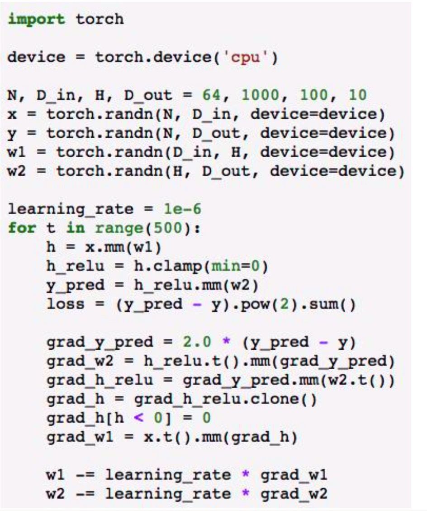

### Autograd

用 require_grad=True 来激活 autograd，有 requires_grad 的操作符让Pytorch 建立一个计算图

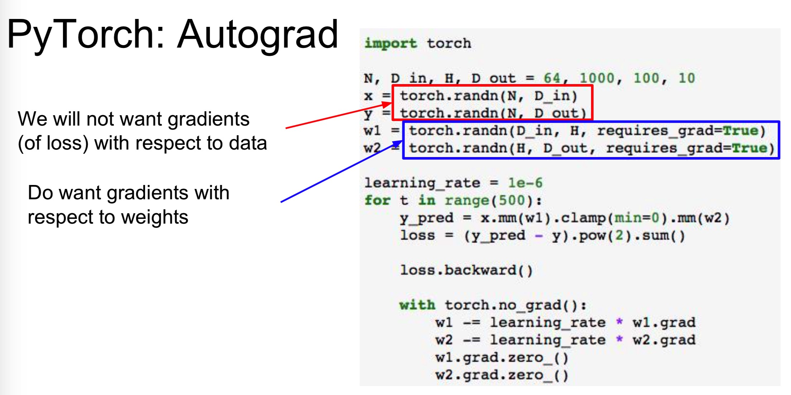

这里面前向传播与之前看起来一样，但是我们没必要追踪中间值，Pytorch在图中为我们自动追踪。

Pytorch 以下划线结束的方法在原位修改这个tensor，并且不返回新的 tensor

### New Autograd Functions

写前向和反向传播函数来定义我们自己的autograd函数，使用 ctx 对象来 cache 反向传播需要的 对象

定义一个 helper function (my_relu)来更简单的使用这个函数

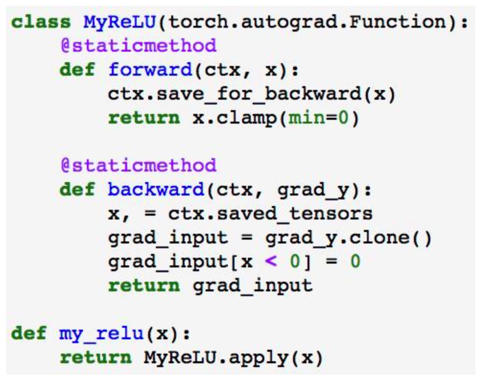

然后我们可以使用自己的定义的函数来放到前向传播里


在实际中我们甚至不用定义新的 autograd 函数，我们可以直接使用一个简单的函数

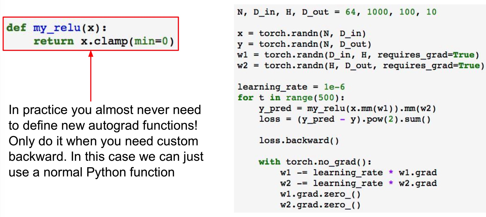

### nn

使用更高级的包装层会让你的生活更加简单（笑）

把我们的模型定义为层的序列， 每一层是一个放置可学习的权重的对象。前向传播中放入data到模型然后计算loss。torch.nn.functional 有像 loss function 之类的好用的 helpers。

反向传播计算模型的所有权重的梯度

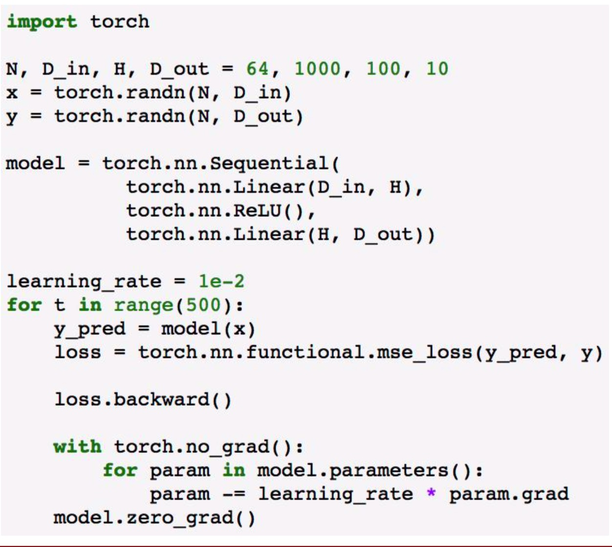

### optim

可以使用一个optimizer 来表示不同的更新规则。

在计算梯度之后，使用optimizer 来更新参数和零置梯度。

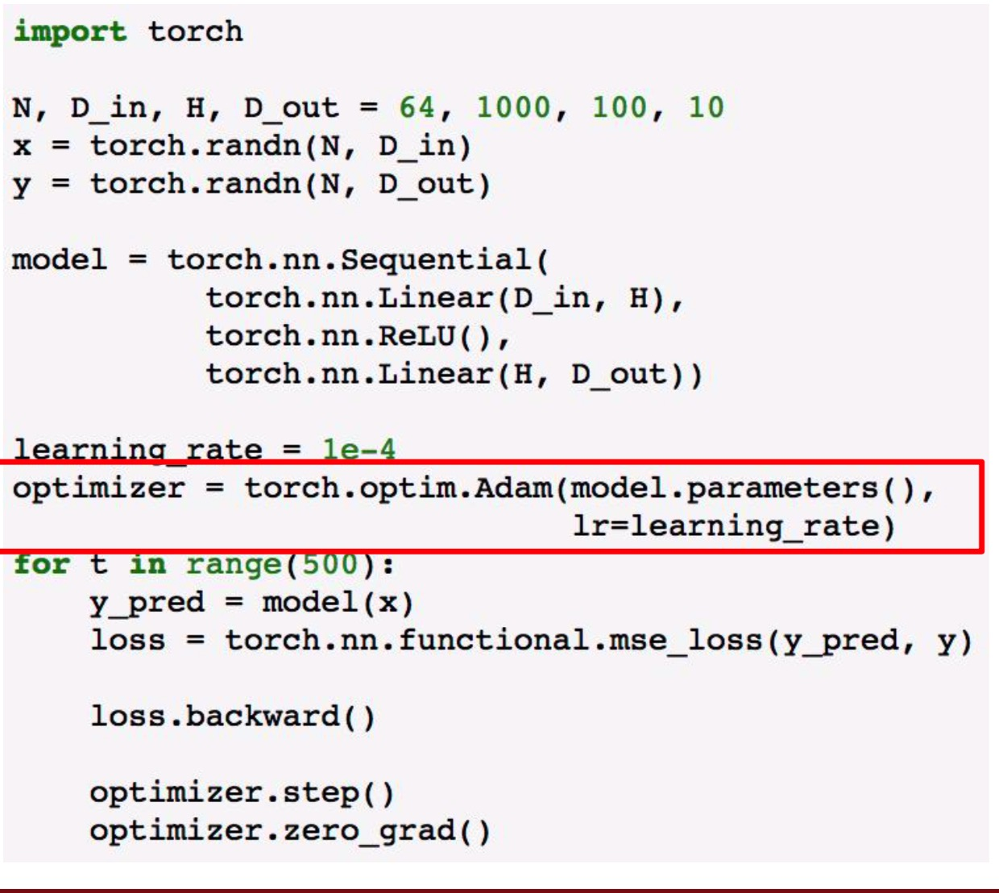

### Define new Modules

一个Pytorch Module 是一个神经网络层，它输入和输出 tensors，它可以包含权重和其他 module，我们可以定义自己的module 来使用autograd。

看下面的代码，不需要定义 backward 因为autograd 会自动处理它


常见混合不同的module 子类和序列

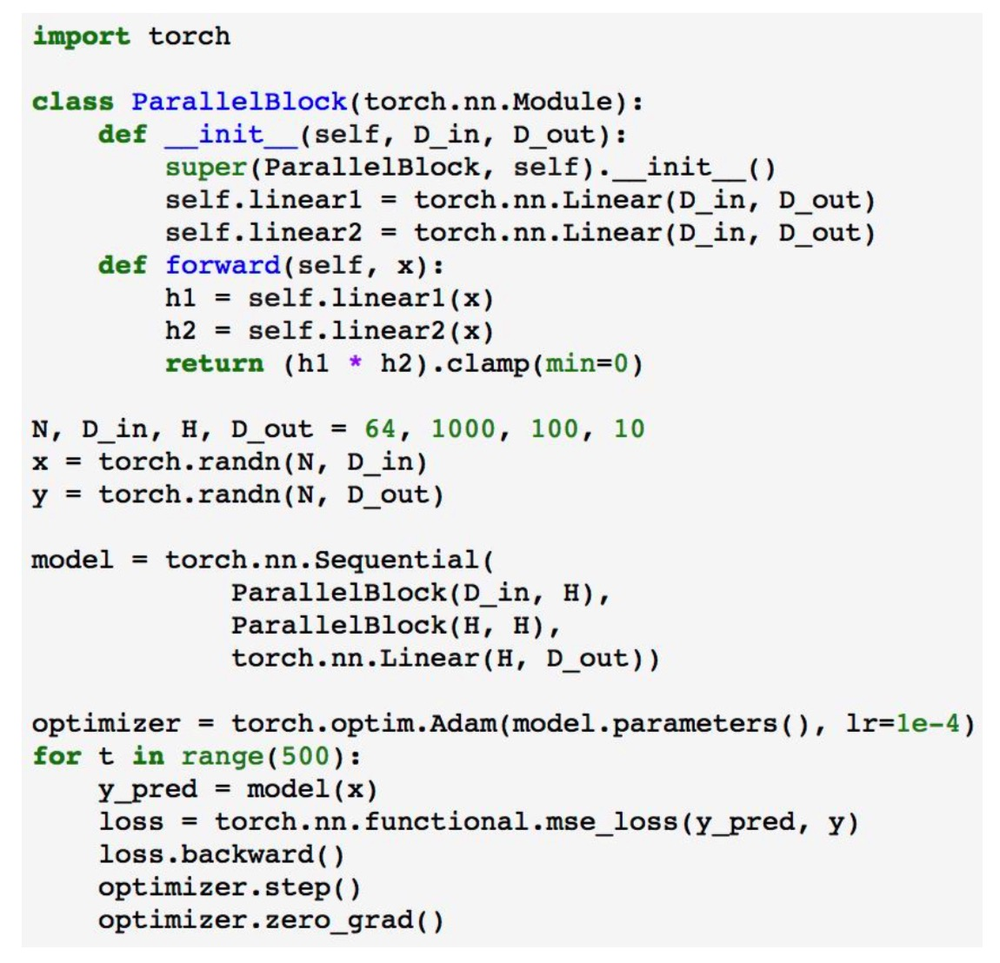

计算图

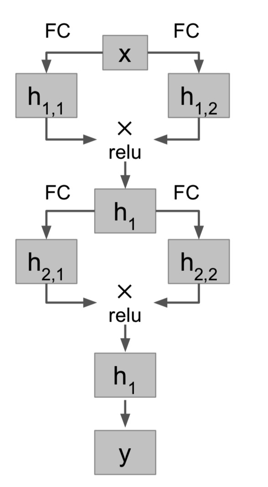

### DataLoaders

DataLoader 包装了一个 dataset 并且提供了 minibatching, shuffling, multithreading 等

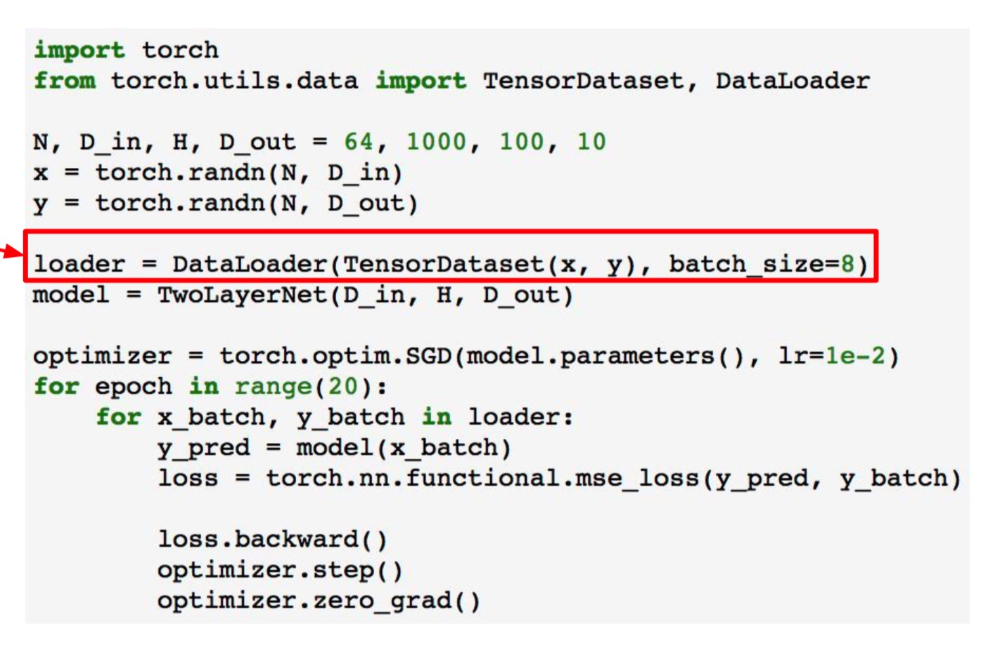

### Pretrained Models

用 torchvision 来导入 pretrained models 


### Visdom

可视化工具：在代码中加入 logging 然后就可以在浏览器中可视化。然而现在还无法可视化计算图结构


### Dynamic Computational Graphs

建立图和计算图是同时进行的，这样不是很高效，因为我们在迭代的时候需要不断的重新建立相同的图

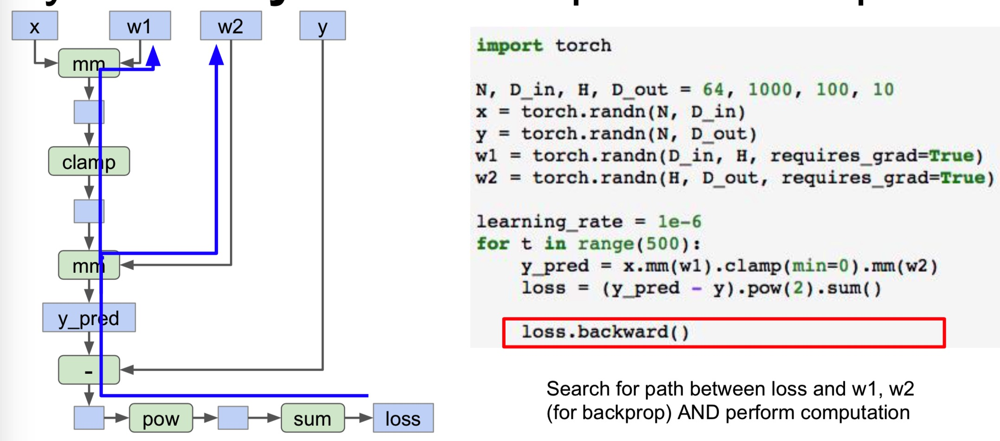

所以就有了 **Static Computational Graphs**

**Step 1**：建立计算图来描述我们的计算

**step 2** ：在每次迭代复用相同的计算图  


## Tensorflow

### Neural Net

前面要先

```python
import numpy as np
import tensorflow as tf
```

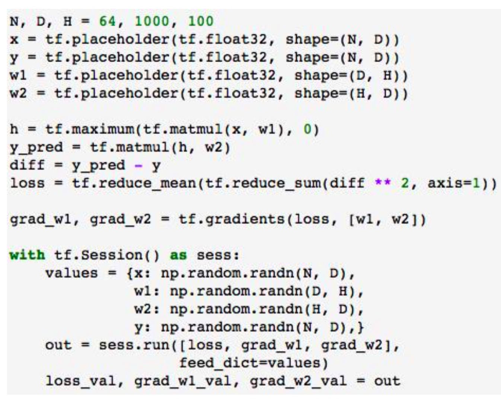

前面先定义计算图，然后不断的在图上计算多次


先为 输入 x，权重 w1,w2，输出 y 创建 placeholders，然后前向传播：计算y的预测值和损失，这里面并没有真正的计算，只是建立图（只有在 tf.Session 中才真正开始计算）。然后计算 w1 和 w2 的梯度，同样的只是建立图，至此我们的计算图已经建好了。

然后创建一个 session 来实际的运行这个图。创建numpy 数组填入之前的 placeholders ，然后运行这个图，得到 loss,grad_w1, 和 grad_w2。

可以通过不断重复的运行这个图，使用梯度来更新权重，从来达到训练的效果


但是这里面有一个问题，在每一步中从CPU 和 GPU 中来回复制权重速度是很慢的，在训练中中我们将numpy 数组传入tensorflow中，然后再从tensorflow 中传回numpy（更新权重），然后再传入tensotflow...

为了解决这个问题，将 w1 w2 从 placeholder （每次训练都要喂入数据）变为 Variable （在训练步之间是保持不变的）


因为它们是存在于计算图中的，所以需要告诉tensorflow 如何初始化它们的值（原来是numpy 初始化然后fed 进计算图）

然后增加 assign 操作符作为图的一部分来更新 w1 w2 

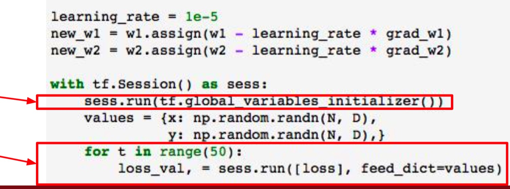

上面的代码有个问题是，assign 实际上并没有被执行，loss 没有下降

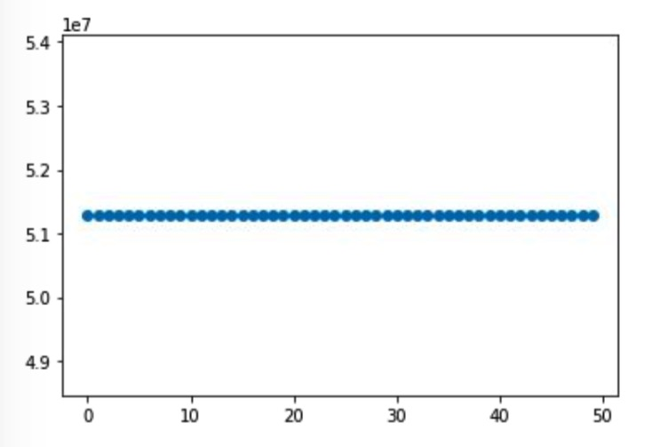

我们需要明确的告诉 tensorflow 来执行这些更新操作，可以定义一个 group 节点将所有要更新的组合起来，然后告诉tensorflow 计算这个 group 节点

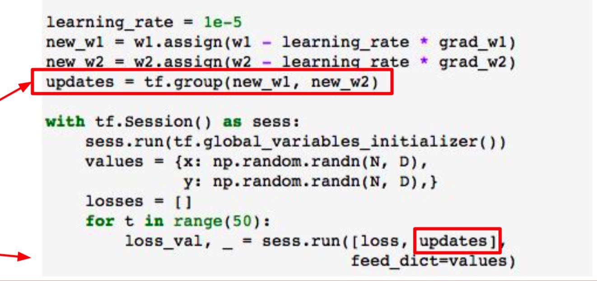

### Optimizer

这样操作是有些麻烦的，我们可以使用一个 optimizer 来计算梯度和更新权重（optimizer.minimize 里面其实是整合了上面new_w1 new_w2  updates）


### Loss

也可以使用预先定义好的常见损失函数


### Layers

在 tensorflow 中我们可以使用更高抽象层次的函数来构建神经网络，tf.layers 自动帮我们设置权重（和偏置）。下面权重使用了 He intializer

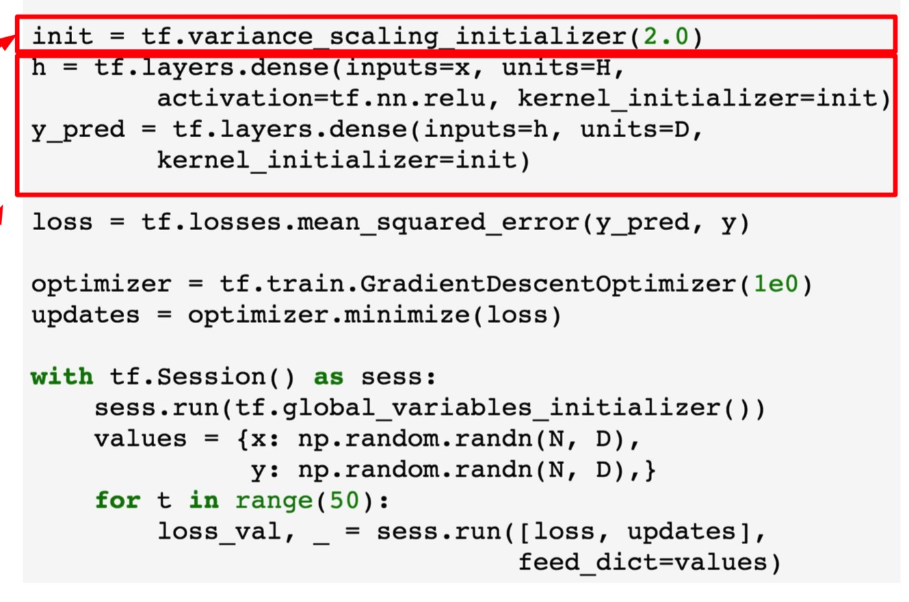

### Keras: Higher-Level Wrapper

Keras 曾是一个第三方库，现在被并入了 tensorflow，它可以让生活更加简单

下面把模型定义成 一个层的序列

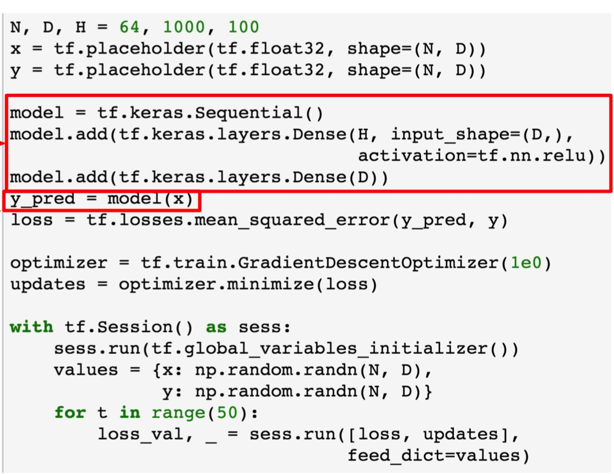

Keras 可以直接处理训练的循环，不再有 sessions 或者 feed_dict

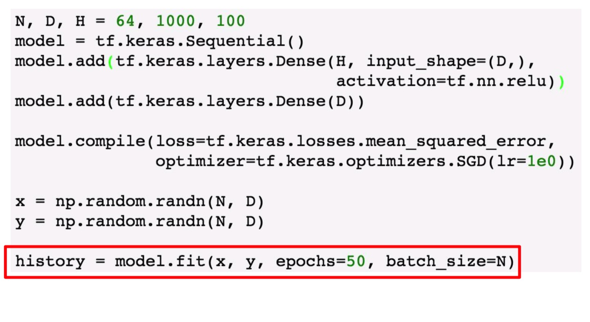

### Pretrained Models

**tf.keras: ** (https://www.tensorflow.org/api_docs/python/tf/keras/applications)

**TF-Slim: ** (https://github.com/tensorflow/models/tree/master/slim/nets)

### Tensorboard

在代码里添加一些logging 来记录 loss, stats 然后我们可以得到一些好看的图像

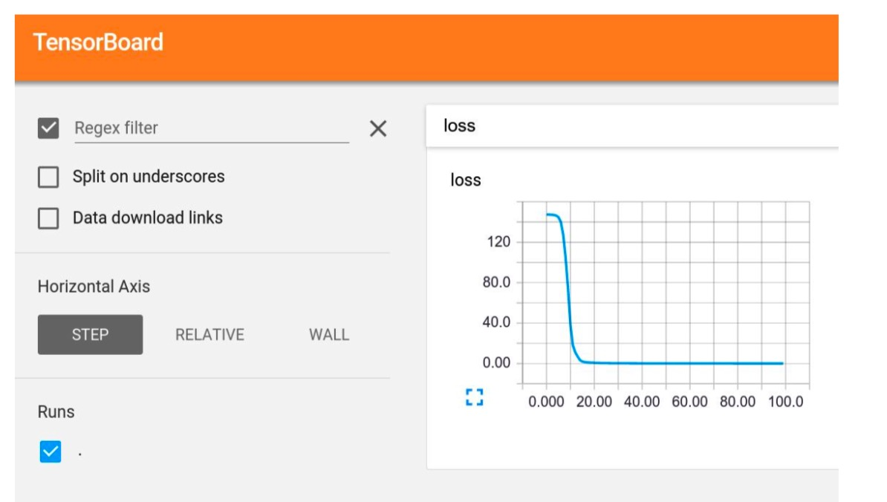


## Static vs Dynamic Graphs

**Tensorflow:** 只建立图一次，然后在图上运行多次 (**Static**)

**PyTorch: ** 每次前向传播都定义一个新的图 (**dynamic**)

### Serialization

**Static:** 一旦图建立了，我们可以序列化它到磁盘里，并且可以在没有代码的情况下加载然后运行它

**Dynamic:** 图建立和执行是相互交叉的，所以总是需要代码

### Conditional

Dynamic 可能会让你的代码更加简洁，比如下面的条件语句。在Static 中因为我们只建立图一次，需要把所有的控制流都提前建立好

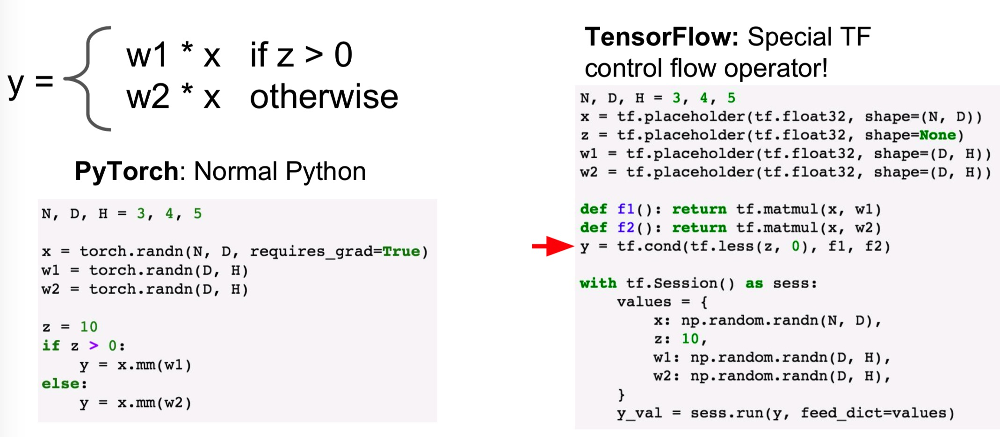

### Loops

比如下面的循环


### Dynamic Graph Applications

* Recurrent networks

* Recursive networks

* Modular nerworks
## PyTorch vs Tensorflow, Static vs Dynamic

PyTorch 和 Tensorflow 的界限在模糊，Pytorch 中有增加静态特性而 Tensorflow 有增加动态特性

### Dynamic Tensorflow: Eager Execution

在最开始激活 eager mode，这是一个全局开关

然后通过 tf.random_normal 建立实值，不再需要placeholders 或者 sessions

在 GradientTape 下的操作将会建立一个与 PyTorch 相似的动态图，然后使用tape 来计算梯度

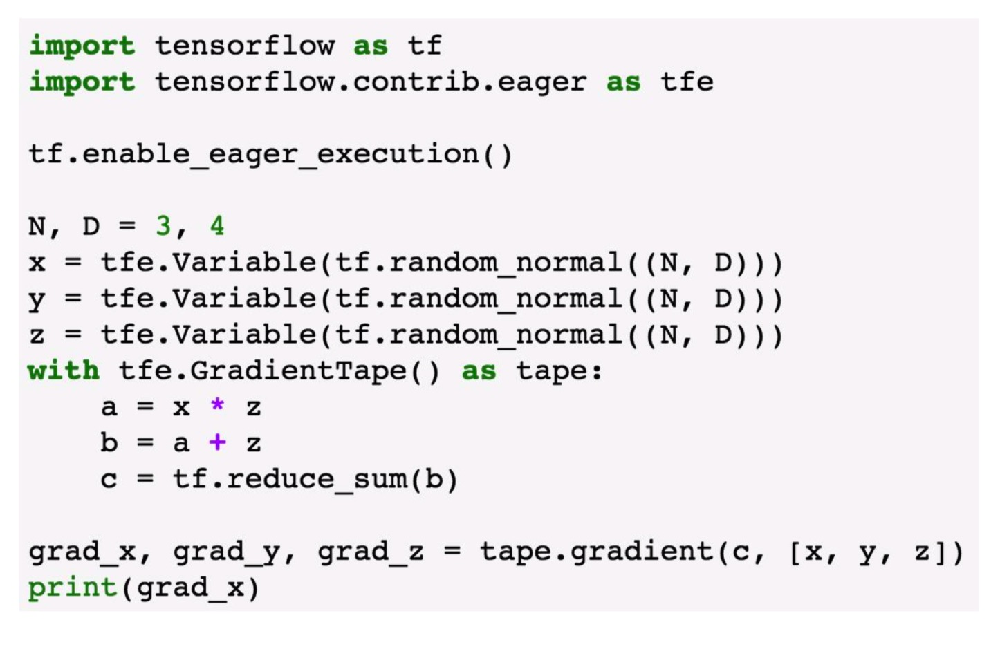

但 Eager 还是非常新的一个操作，没有被所有的 tensorflow APIs 所支持。

### Static PyTorch: ONNX Support

ONNX 是一个神经网络的开源的标准，目标是使得在一个框架中训练然后在另一个框架中运行变得更加容易。

它现在被 PyTorch Caffe2 Microsoft CNTK Apache MXNet 所支持

我们可以用 ONNX 将一个 Pytorch 模型导出，在一个仿制节点上运行图然后将它保存到一个文件中。这只会在你的模型没有实际上利用动态图的时候有效——必须在每个前向传播中建立相同的图，没有循环和条件。

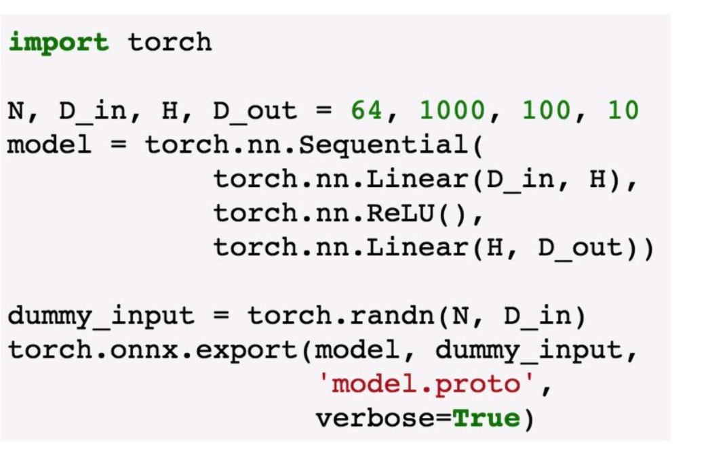

我们可以先在Pytorch 中建立模型，然后应用到产品或移动端时用 ONNX 导出到 Caffe2 中。


