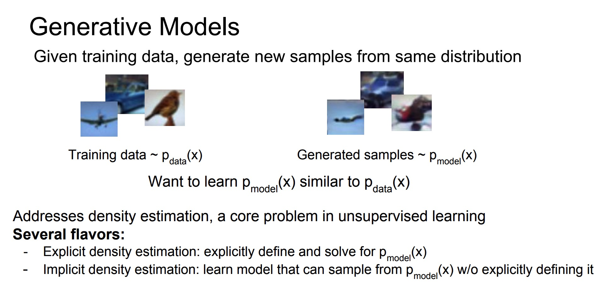
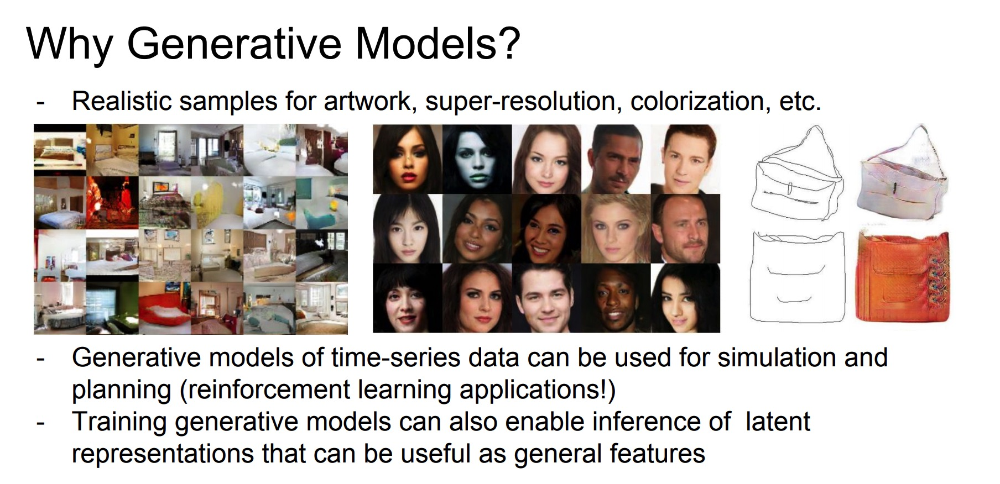
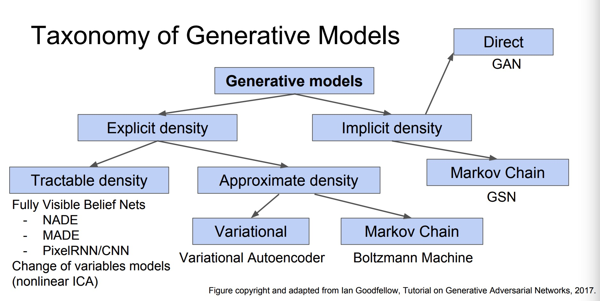
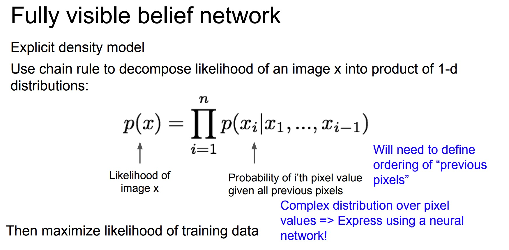
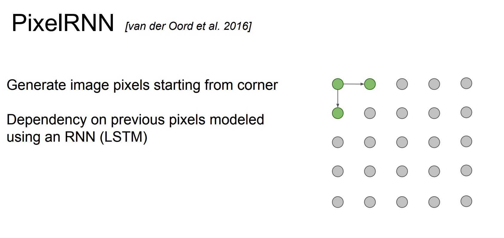
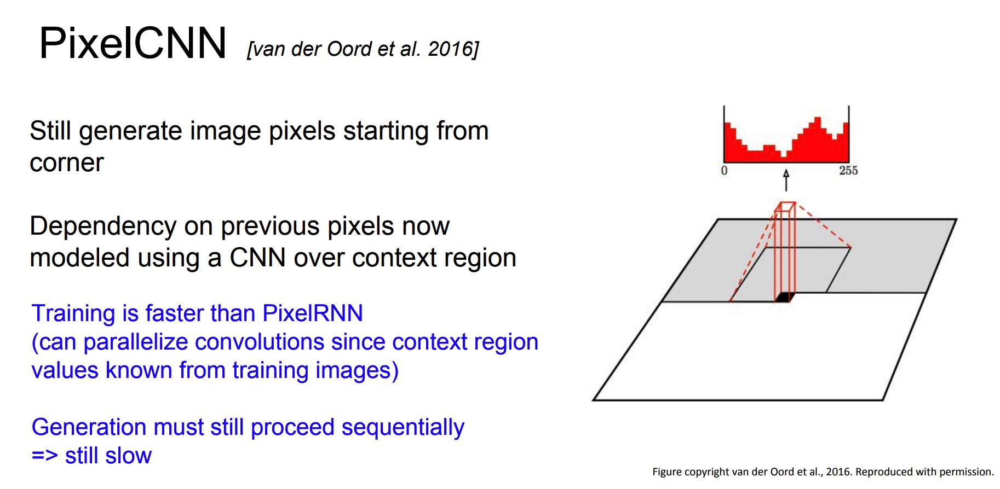
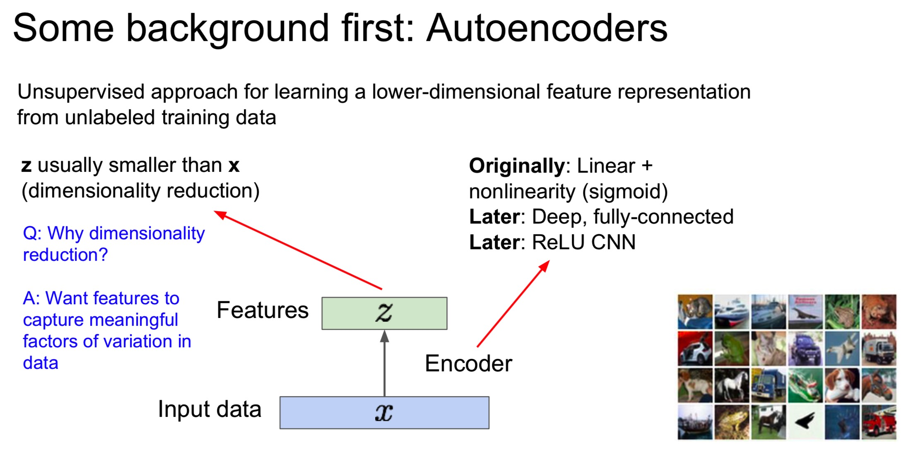
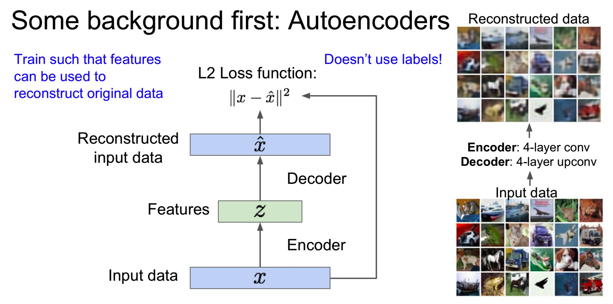
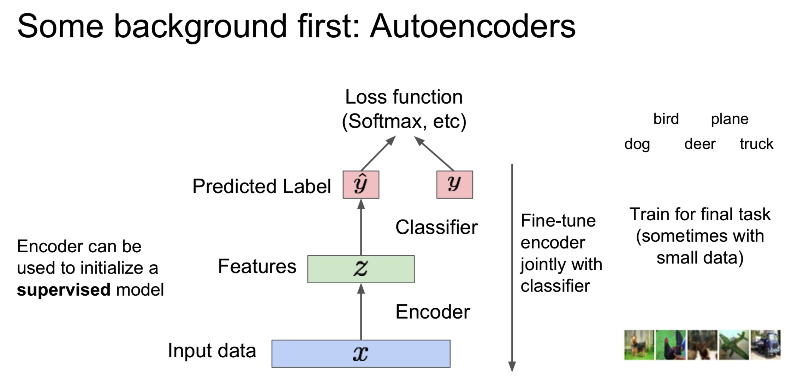

Unsupervised Learning：只有数据没有标签，我们的目标是学到一些潜在的数据中的结构，比如聚类，降维PCA，特征学习，密度估计等。

Generative Models:

给定训练数据，学得一个p-model，并用p-model生成新的数据，我们希望p-model 和 p-data 尽可能的相似。

可以分为显式密度估计和隐式密度估计。

为什么Generative Models很重要？

Generative Models的一些分类：

我们使用链式法则来分解image x的可能性，然后最大化训练数据的likelihood：

但是这个在每个pixel values上的分布非常的复杂，我们可以用神经网络来表达它。

PixelRNN:

从corner生成pixels，用RNN(LSTM)来解决之前的像素的依赖，缺点是这个序列生成太慢了。

PixelCNN:

仍然是从corner生成pixels，但与PixelRNN不同的是，这里直接使用CNN来解决之前的像素的依赖，然后最大化训练图像的似然

Variational AutoEncoder(VAE) ，它引入了一个隐变量，这不好直接优化

什么是Autoencoders?它是一个无监督学习，目标是从一堆无标签的训练数据中学到一个低维的feature representation

为什么要降维呢？因为我们想找到数据中最重要的特征。

我们训练这样的特征z 使得它能够用来重建原来的数据x，我们需要一个encoder来提取x的特征z（CNN卷积） ，然后再用一个decoder重建数据（CNN upsampling），然后将该数据与输入计算一个loss，想让这个loss尽可能小，也就是pixels 之间相差很小。

encoder可以用来初始化一个监督模型

GAN：Generative Adversarial Networks

