循环神经网络（RNN）是一类用于处理序列数据的神经网络，可以扩展到更长的序列，大多数循环网络也能处理可变长度的序列。

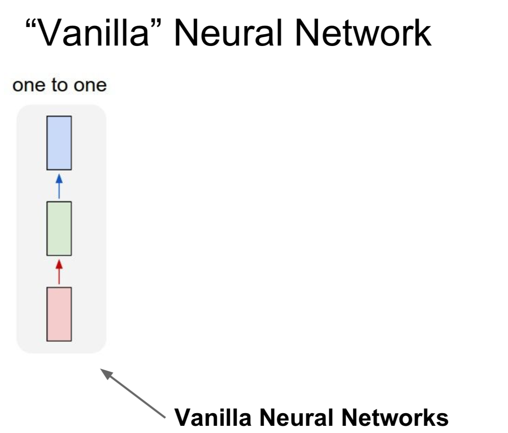

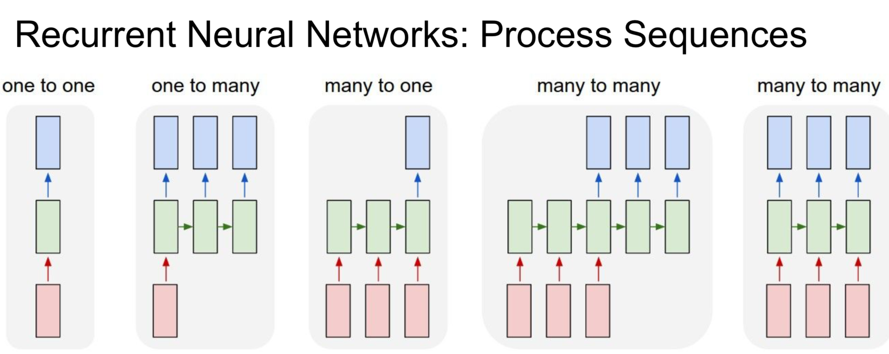


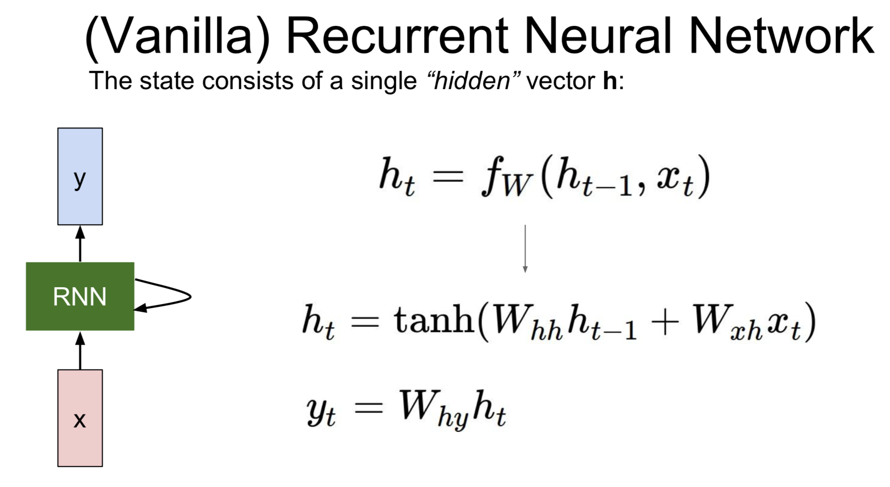

需要一个额外的 $W_{hy}$ 来对 $h_t$ 操作从而生成一个 $y_t$ 

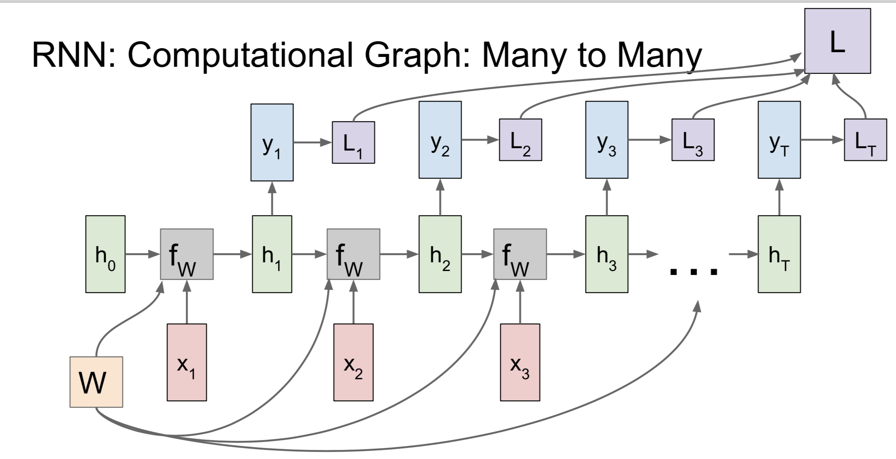

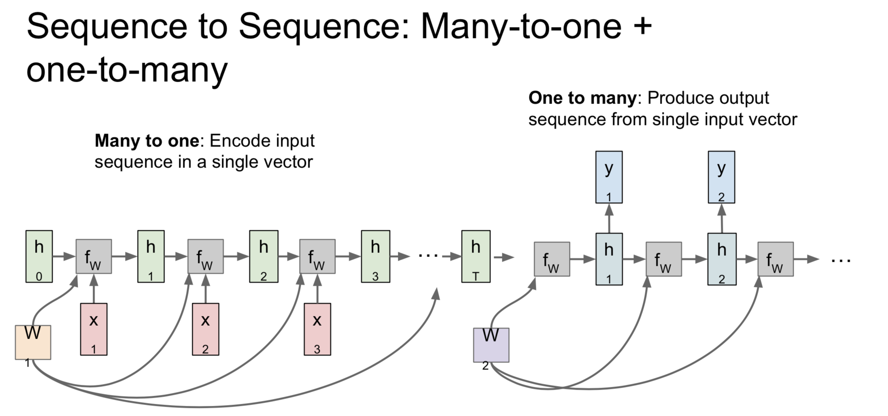

在语言建模中经常会用到卷积神经网络


我们训练的是几个W矩阵，然后预测时每次输入一个字母然后对应输出一个字母，然后再把输出的这个字母当成输入依次进行。

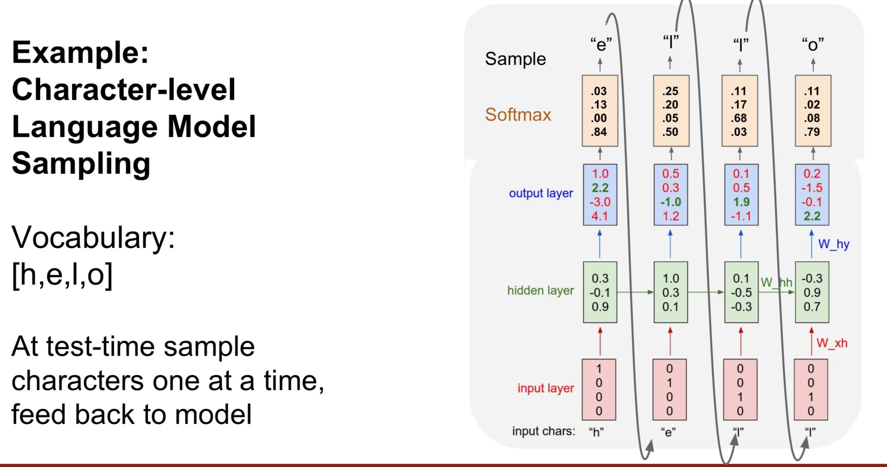

注意这个输出是依据softmax层的一个sample采样，这样可以使得输出更多样化，也会更合理。

在整个序列上前向和反向传播是非常占内存的而且很慢，所以提出了沿时间的截断反向传播算法


它在一部分序列上先前向和反向传播然后计算损失，然后再进入下一部分，需要注意的是这个前向和反向只持续一定的时间步。

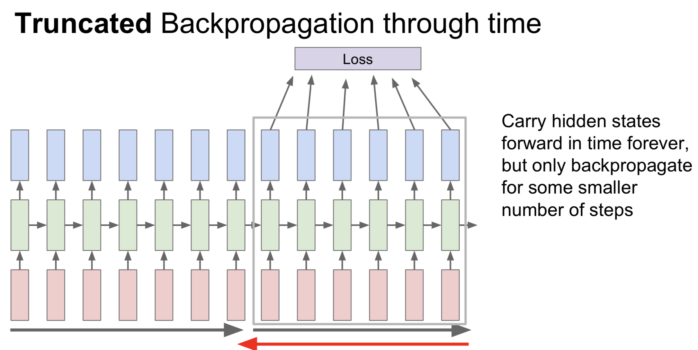

下面是 karpathy 的一个 rnn 的简单实现

```python
"""
Minimal character-level Vanilla RNN model. Written by Andrej Karpathy (@karpathy)
BSD License
"""
import numpy as np

# data I/O
data = open('input.txt', 'r').read() # should be simple plain text file
chars = list(set(data))
data_size, vocab_size = len(data), len(chars)
print 'data has %d characters, %d unique.' % (data_size, vocab_size)
char_to_ix = { ch:i for i,ch in enumerate(chars) }
ix_to_char = { i:ch for i,ch in enumerate(chars) }

# hyperparameters
hidden_size = 100 # size of hidden layer of neurons
seq_length = 25 # number of steps to unroll the RNN for
learning_rate = 1e-1

# model parameters
Wxh = np.random.randn(hidden_size, vocab_size)*0.01 # input to hidden
Whh = np.random.randn(hidden_size, hidden_size)*0.01 # hidden to hidden
Why = np.random.randn(vocab_size, hidden_size)*0.01 # hidden to output
bh = np.zeros((hidden_size, 1)) # hidden bias
by = np.zeros((vocab_size, 1)) # output bias

def lossFun(inputs, targets, hprev):
  """
  inputs,targets are both list of integers.
  hprev is Hx1 array of initial hidden state
  returns the loss, gradients on model parameters, and last hidden state
  """
  xs, hs, ys, ps = {}, {}, {}, {}
  hs[-1] = np.copy(hprev)
  loss = 0
  # forward pass
  for t in xrange(len(inputs)):
    xs[t] = np.zeros((vocab_size,1)) # encode in 1-of-k representation
    xs[t][inputs[t]] = 1
    hs[t] = np.tanh(np.dot(Wxh, xs[t]) + np.dot(Whh, hs[t-1]) + bh) # hidden state
    ys[t] = np.dot(Why, hs[t]) + by # unnormalized log probabilities for next chars
    ps[t] = np.exp(ys[t]) / np.sum(np.exp(ys[t])) # probabilities for next chars
    loss += -np.log(ps[t][targets[t],0]) # softmax (cross-entropy loss)
  # backward pass: compute gradients going backwards
  dWxh, dWhh, dWhy = np.zeros_like(Wxh), np.zeros_like(Whh), np.zeros_like(Why)
  dbh, dby = np.zeros_like(bh), np.zeros_like(by)
  dhnext = np.zeros_like(hs[0])
  for t in reversed(xrange(len(inputs))):
    dy = np.copy(ps[t])
    dy[targets[t]] -= 1 # backprop into y. see http://cs231n.github.io/neural-networks-case-study/#grad if confused here
    dWhy += np.dot(dy, hs[t].T)
    dby += dy
    dh = np.dot(Why.T, dy) + dhnext # backprop into h
    dhraw = (1 - hs[t] * hs[t]) * dh # backprop through tanh nonlinearity
    dbh += dhraw
    dWxh += np.dot(dhraw, xs[t].T)
    dWhh += np.dot(dhraw, hs[t-1].T)
    dhnext = np.dot(Whh.T, dhraw)
  for dparam in [dWxh, dWhh, dWhy, dbh, dby]:
    np.clip(dparam, -5, 5, out=dparam) # clip to mitigate exploding gradients
  return loss, dWxh, dWhh, dWhy, dbh, dby, hs[len(inputs)-1]

def sample(h, seed_ix, n):
  """ 
  sample a sequence of integers from the model 
  h is memory state, seed_ix is seed letter for first time step
  """
  x = np.zeros((vocab_size, 1))
  x[seed_ix] = 1
  ixes = []
  for t in xrange(n):
    h = np.tanh(np.dot(Wxh, x) + np.dot(Whh, h) + bh)
    y = np.dot(Why, h) + by
    p = np.exp(y) / np.sum(np.exp(y))
    ix = np.random.choice(range(vocab_size), p=p.ravel())
    x = np.zeros((vocab_size, 1))
    x[ix] = 1
    ixes.append(ix)
  return ixes

n, p = 0, 0
mWxh, mWhh, mWhy = np.zeros_like(Wxh), np.zeros_like(Whh), np.zeros_like(Why)
mbh, mby = np.zeros_like(bh), np.zeros_like(by) # memory variables for Adagrad
smooth_loss = -np.log(1.0/vocab_size)*seq_length # loss at iteration 0
while True:
  # prepare inputs (we're sweeping from left to right in steps seq_length long)
  if p+seq_length+1 >= len(data) or n == 0: 
    hprev = np.zeros((hidden_size,1)) # reset RNN memory
    p = 0 # go from start of data
  inputs = [char_to_ix[ch] for ch in data[p:p+seq_length]]
  targets = [char_to_ix[ch] for ch in data[p+1:p+seq_length+1]]

  # sample from the model now and then
  if n % 100 == 0:
    sample_ix = sample(hprev, inputs[0], 200)
    txt = ''.join(ix_to_char[ix] for ix in sample_ix)
    print '----\n %s \n----' % (txt, )

  # forward seq_length characters through the net and fetch gradient
  loss, dWxh, dWhh, dWhy, dbh, dby, hprev = lossFun(inputs, targets, hprev)
  smooth_loss = smooth_loss * 0.999 + loss * 0.001
  if n % 100 == 0: print 'iter %d, loss: %f' % (n, smooth_loss) # print progress
  
  # perform parameter update with Adagrad
  for param, dparam, mem in zip([Wxh, Whh, Why, bh, by], 
                                [dWxh, dWhh, dWhy, dbh, dby], 
                                [mWxh, mWhh, mWhy, mbh, mby]):
    mem += dparam * dparam
    param += -learning_rate * dparam / np.sqrt(mem + 1e-8) # adagrad update

  p += seq_length # move data pointer
  n += 1 # iteration counter 
```

尽管RNN 学习的是预测下个字符是什么，但是不知为何它也学到了一些结构，比如双引号，什么时候空格，缩进之类的结构，虽然很多哦内容并无意义，但是学到了结构这一点还是非常神奇的。

在 Karpathy 的一篇论文中，他将每个字符的词向量中的一个元素标记出来，看看在每个字符这个元素的大小，用颜色标记，比如下面就学到了双引号。


仅在一个时间步的输出和下一个时间步的隐藏单元间存在循环连接的网络没有那么强大（缺乏隐藏到隐藏的循环连接），但是这样基于比较任何时刻 t 的预测和时刻 t 的训练目标的损失函数中的所有时间步都解耦了，训练可以并行化，即在各时刻 t 分别计算梯度。

从输出反馈到模型而产生循环连接的模型可用导师驱动过程(teacher forcing),所谓导师驱动，指的就是将真实值 $y^{(t)}$ 作为输入 反馈到 $h^{(t+1)}$ ，在测试时，用模型的输出 $o^{(t)}$ 近似正确的输出 $y^{(t)}$ 并反馈回模型

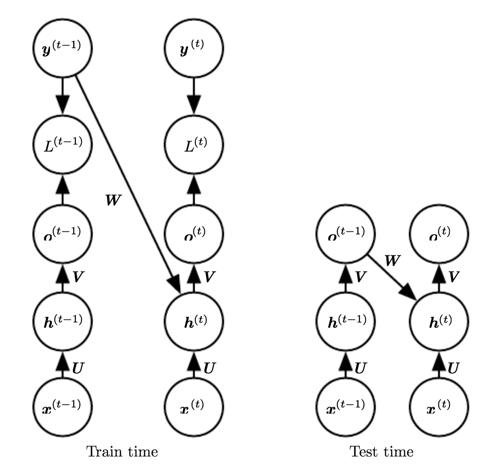

计算循环神经网络的梯度：

通过时间的反向传播算法(back-propagation through time, BPTT)

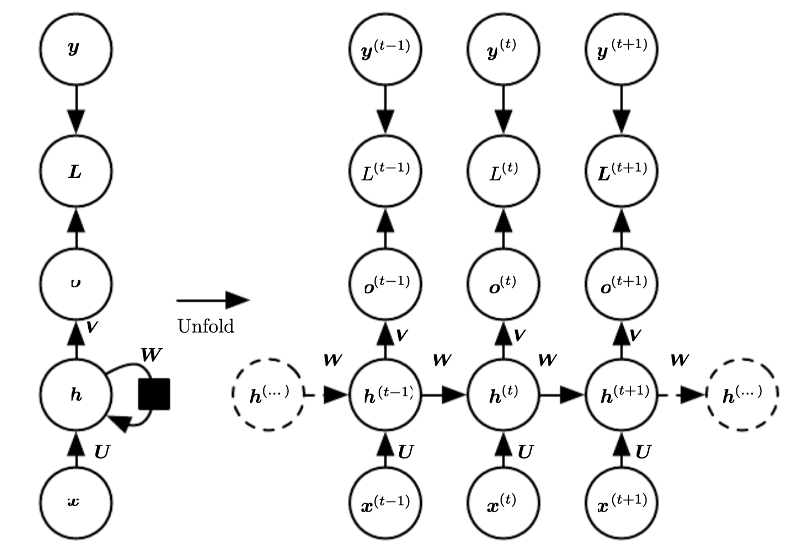


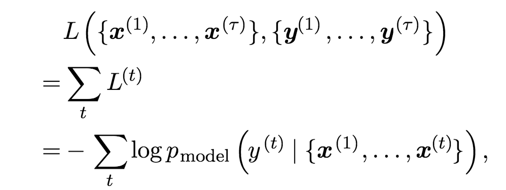

计算图的节点包括参数 $\mathbf{U},\mathbf{V},\mathbf{W},\mathbf{b},\mathbf{c}$ 

 反向传播需要需要先计算每个内部节点的梯度，然后根据内部节点的梯度计算参数的梯度，L 是负对数损失函数，对所有的i, t, 关于时间步 t：


从序列的末尾开始反向进行计算，在最后的时间步 $\tau$ , $h^{(\tau)}$ 只有 $o^{(\tau)}$ 作为 后续节点：


然后从时刻 $t = \tau -1$ 到 $ t =1$ 反向传播


$diag(1-{(h^{(t+1)})}^2)$ 是关于时刻 t+1 与隐藏单元 i 关联的双曲正切 Jacobian阵

现在内部节点的梯度已经有了，下面就可以计算各个参数节点的梯度


基于上下文的RNN序列建模：

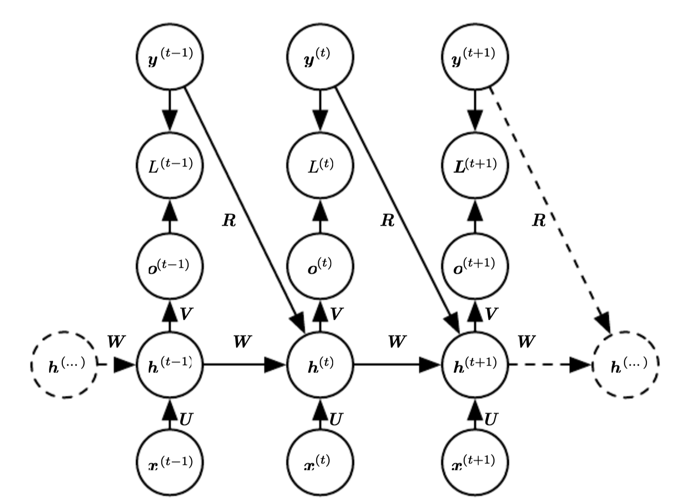

双向RNN:

在很多应用中，我们要输出的 $y^{(t)}$ 的预测可能依赖于整个输入序列，比如在机器翻译中，当前单词的翻译可能取决于未来几个单词，因为词与词之间存在语义依赖，双向RNN为满足这种需要而发明。

双向RNN结合时间上从序列起点开始移动的RNN和另一个从序列末尾开始移动的RNN。


基于编码-解码的序列到序列架构：

我们将RNN的输入称为上下文，希望产生此上下文的表示C，它可能是一个概括输入序列的向量或向量序列，这个网络由：

*  编码器处理输入序列，输出上下文C，它表示输入序列的语义概要并作为解码器RNN的输入
* 解码器则以固定长度的向量为条件产生输出序列 Y

两个RNN共同训练以最大化 $log  \ P(y^{(1)},…,y^{(n_y)})$ 

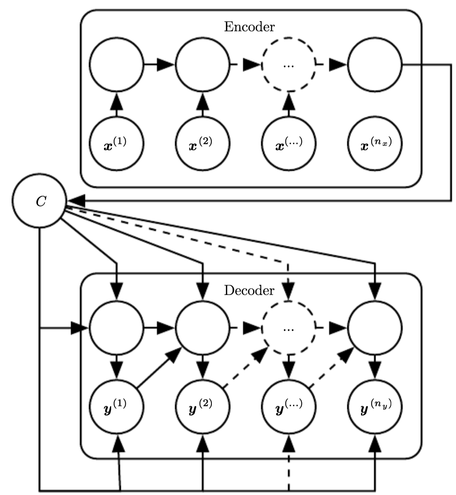

学习RNN的数学挑战在于梯度消失或爆炸问题，由于长期依赖关系的信号很容易被短期相关性产生的最小波动隐藏，因而学习长期依赖可能需要很长时间的时间。

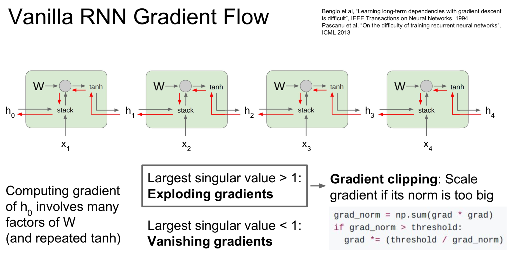


我们想要输出描述图像的句子，需要先将图像卷积生成一个全连接层，然后将这个全连接层作为RNN的输入

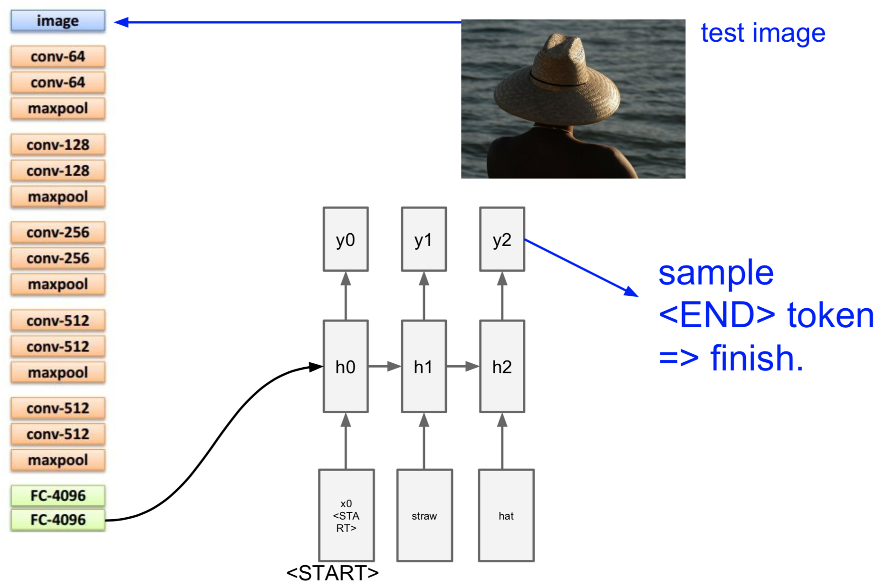

注意力模型：

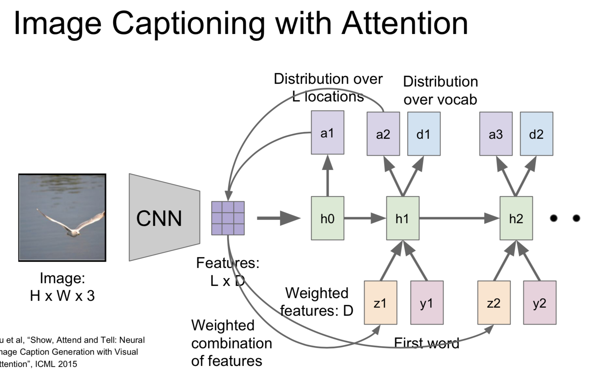

**LSTM:**

它是为了缓解梯度消失和爆炸而提出的一种更高级的RNN网络，它设计一种更好的结构来获取更好的梯度流动


LSTM看起来很神奇，但它的确会很有用