本文总结了 cs231n lecture 13的知识点，介绍了一些理解 CNN 的方法。从**激活**角度来看，有**最近邻**，**降维**，**最大patches**，**遮盖**。从**梯度**角度看，有**显著图**，**特征转换**，**对抗图片**。还有一些有趣的实践：**DeepDream**，**风格迁移**。

卷积神经网络的真正原理是啥，这些卷积层到底找的是什么东西？

####可视化第一层权重:

可视化第一层这些**权重**，看看它们的样子，它们似乎在寻找一些**边角**和**颜色**。

同样我们也可以可视化更高层次的权重：

####最后一层：最近邻

之前我们讨论过直接在像素上做kNN找一幅图片的最近距离的k个图片，同样的我们可以在卷积的最后一层全连接层（4096-dim vector）上，找到距离测试图片最近的k个图片。

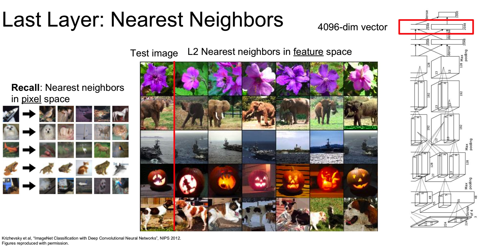

我们可以把最后一层当作一种**降维**的过程，把原本维度很大的图片降维生成4096个聚类，每个图片都对应着一个类。

在机器学习里面我们学习过**PCA**来去除冗杂的维度，一种更复杂的降维方法是**t-SNE**，在下例中，它对minist手写数字降到了2维生成了9个聚类。

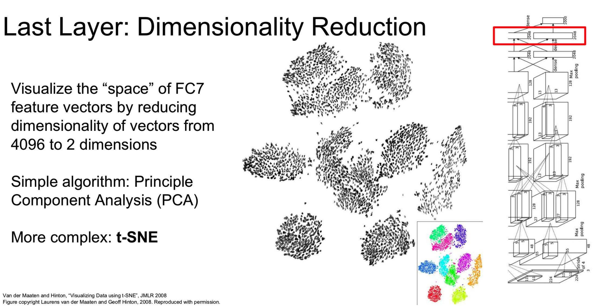

####最大激活 patches

我们也可以取比如**conv5**层上的一个**channel**，比如17/128，我们可以在这个网络上跑很多图片然后记录每个图片上的在这个**channel**上的**values**，然后可视化使得**第17channel**上的激活值最大的的image patches。

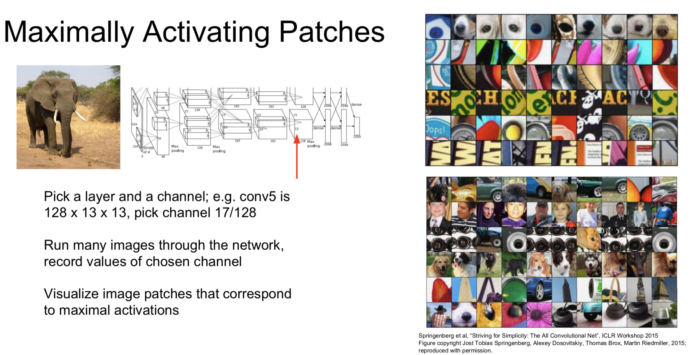

####遮盖实验

我们也可以通过**occlusion**来看图像的哪部分对神经网络分类的影响结果最大，下面这个是通过画**热力图**来直观的展示哪部分影响最大：

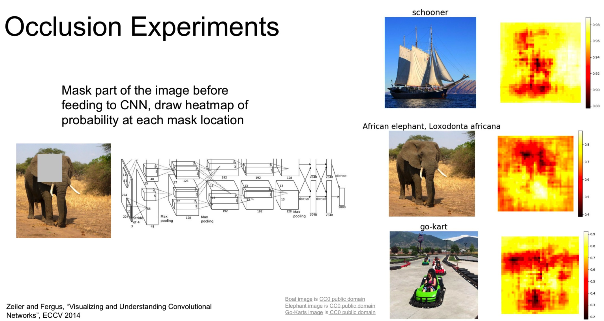

#### 显著图

**saliency maps**(显著图)可以用来告诉我们哪部分 pixels 对分类是重要的，通过计算类分值在每个像素上的梯度，来看当我们对这个像素有一个小扰动时将会对分类分值有多大影响（一阶近似）

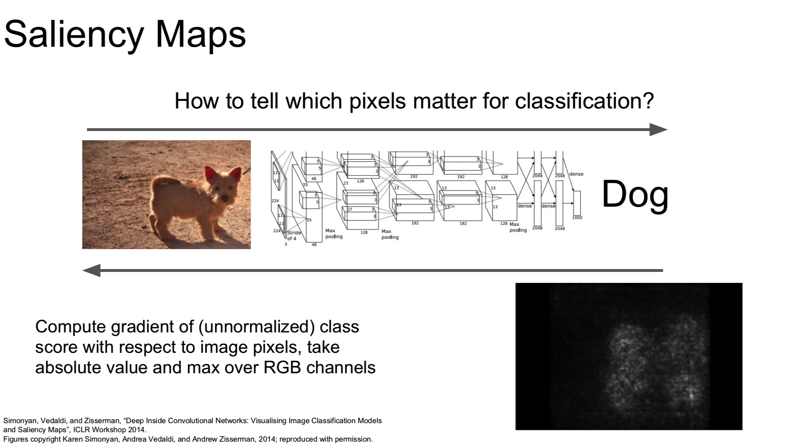

#### 反向传播中间神经元

我们也可以选一个中间神经元，比如在 128x13x13 的conv5 层上选一个值，计算这个神经元的值关于图片像素值的梯度，不过这里面使用的 **guided backprop**，就是只反向传播特征值上大于0的神经元，这样得出的图片会更好看

#### 梯度上升

我们可以通过**梯度上升法**合成一个图片来最大化神经元的激活值。

但我们也需要一些正则化项防止过拟合（看起来自然）

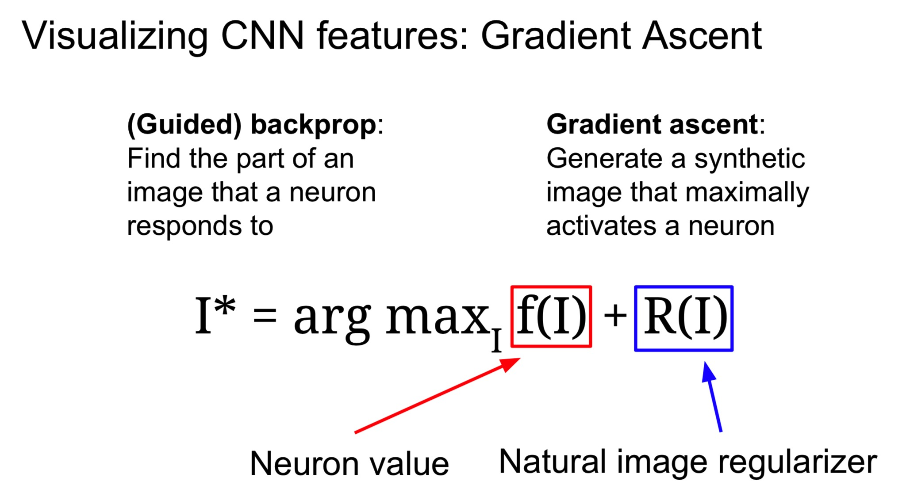

 更好的**正则化**是**L2正则化**加一些定期的**高斯模糊**以及**裁剪**那些小的values 和 gradients 为0，效果更好。

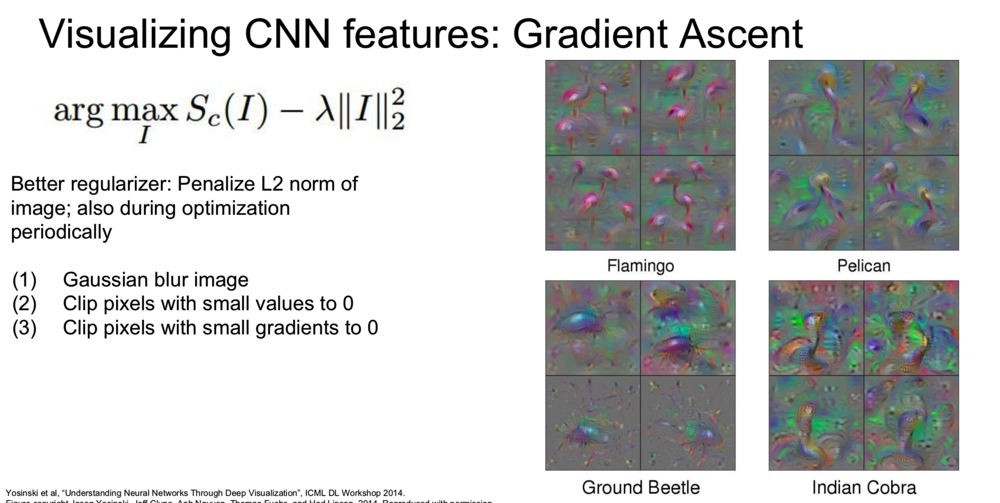

如果增加更加强大的先验图像，会生成非常逼真的图片：

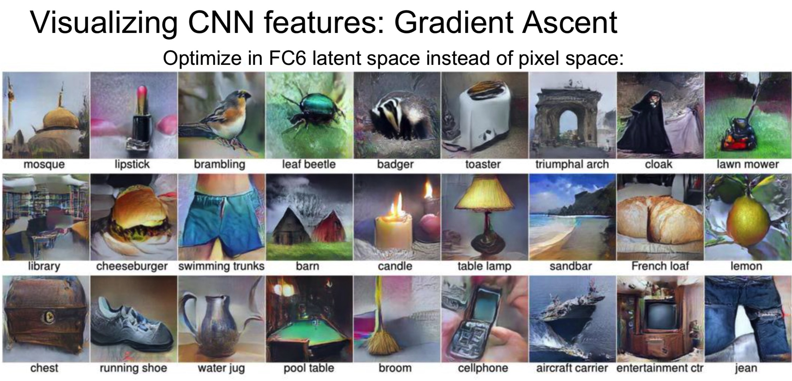

我们可以利用这种方法来生成**对抗样本**，比如拿一张大象的图片，我们想让它通过神经网络的训练来最大化它的袋鼠分类，然后我们看看最后会得到什么样的图片，发现我们肉眼是看不出来与原图片的区别的，但是神经网络却认为它是一个袋鼠。

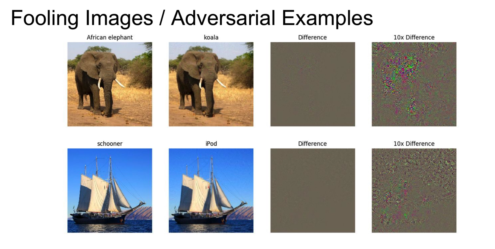

#### Deep Dream

**Deep Dream**:选择一个图片和CNN的一个层，然后计算这个层的激活值，然后让这个层的梯度等于它的激活值，然后反向传播更新这个图片，它相当于最大化某个特征。

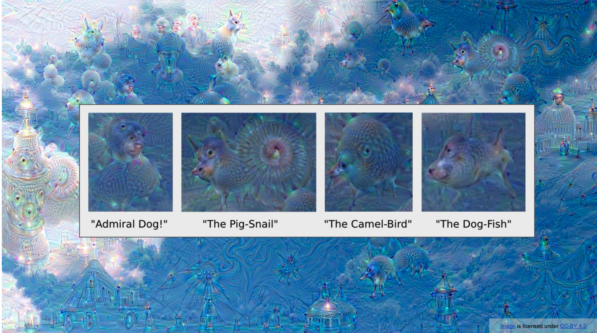

简直像艺术品一样

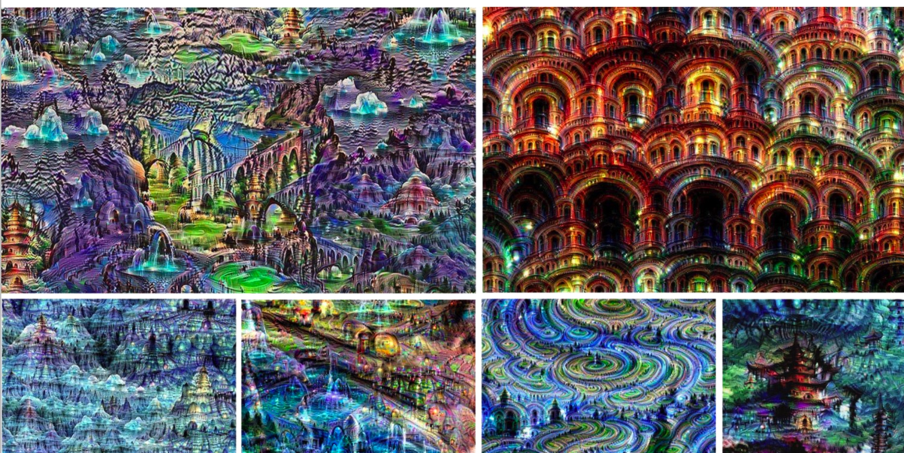

#### 特征转化

给定一个图片在CNN某层上的feature vector，然后我们的目标是创造一个新的图片使得它在同一层的fearture vector十分相近，这叫做**feature inversion**:

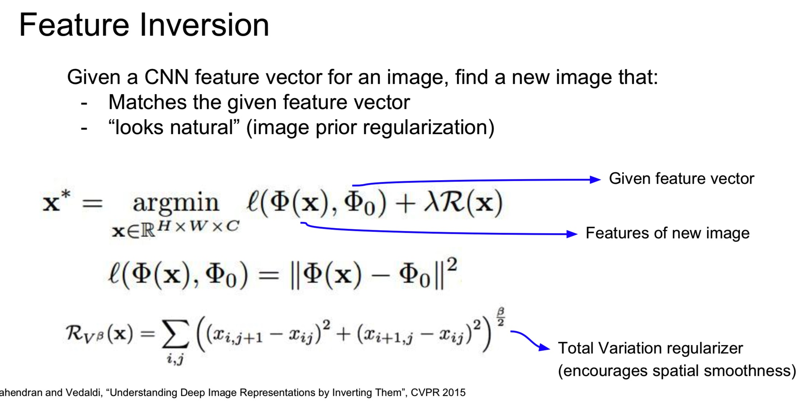

然后我们发现在不同的层上出现的效果不一样，在比较浅的层上与原图像非常相近，随着层数的深入，会失去更多的信息：

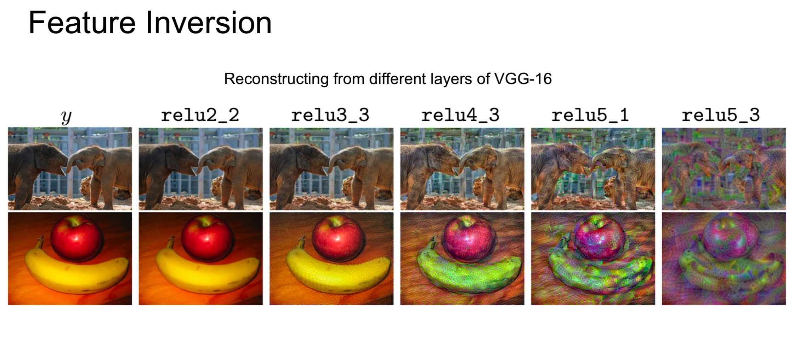

####纹理合成

**纹理合成**：给定一个小纹理怎么生成一个大的纹理图像。我们使用gram matrix来解决这个问题。

每一层CNN都是CxHxW的tensor of features， 我们可以任取两个长度为C的vector，如图中所示，并把它们相乘得到一个CxC的矩阵。

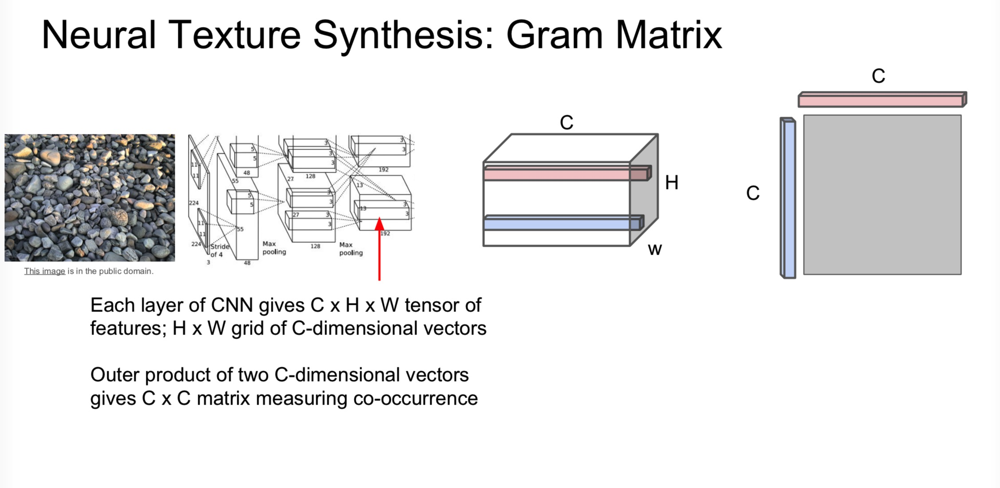

然后把所有HW pairs of vectors加和做个平均，就得到一个CxC的gram matrix。

具体步骤是：输入一个texture图，然后放进一个预处理的VGG-19里，记录每个层的激活值，然后计算相应的gram matriax。然后从随机噪声中初始化一个图片，把它放进CNN然后计算每一层的gram matrix，并计算weighted sum of L2 distance between gram matrix。然后反向传播不断减小这个loss，最后生成一个合成的纹理图

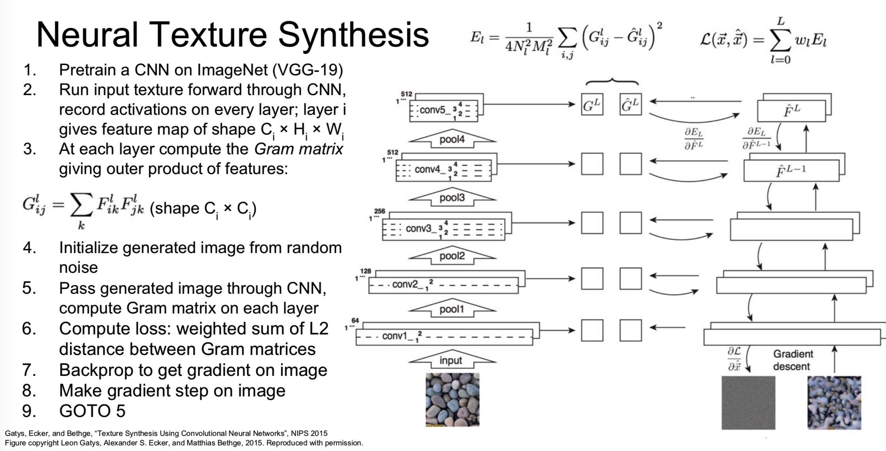

可以用它来生成艺术品

#### 风格迁移

通过feature inversion + gram的合成可以为让图像进行风格迁移

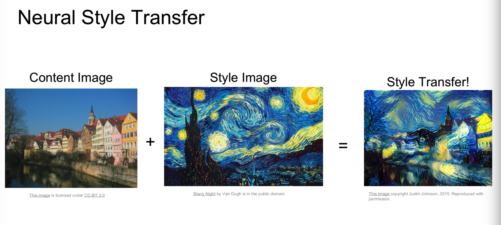

有两个损失，一个是style loss，一个是content loss，我们可以调整两个损失的权重来达到不同的效果。

也可以结合多种风格，只要分配一个权重即可。

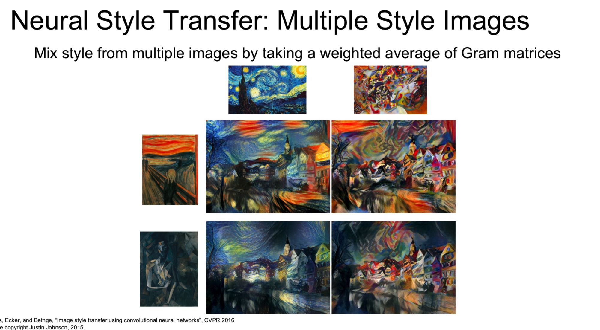

但是风格迁移的速度是非常慢的，它需要前向和反向传播通过VGG很多次，我们可以训练额外的一个神经网络来做风格迁移。

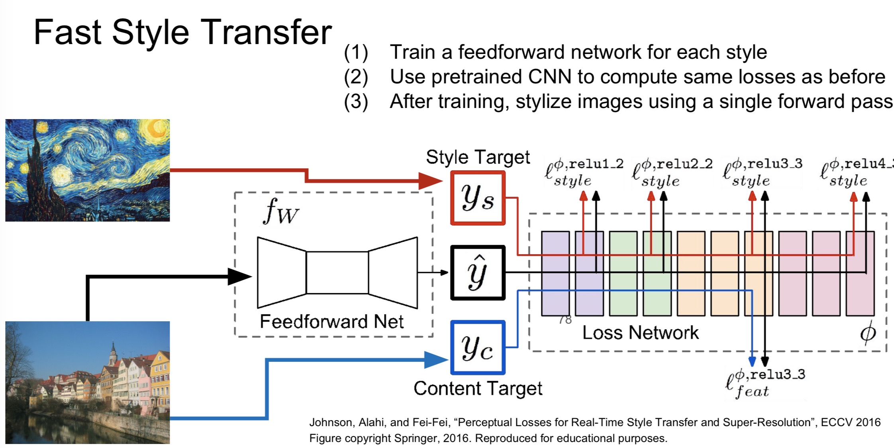

