# CNN Architectures

* AlexNet
* VGG
* GoogLeNet

* ResNet

## AlexNet

[Krizhevsky et al. 2012]

输入：227x227x3 图像

第一层(CONV1)：96 个 11x11 的 stride 为 4 的 filters 

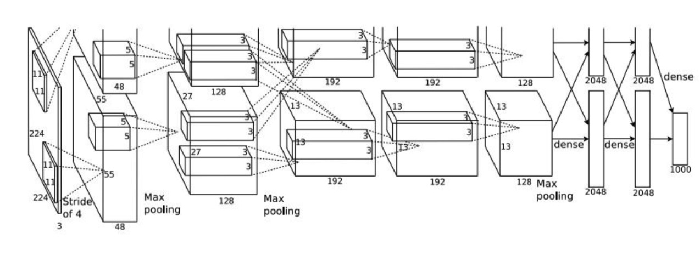

参数：11 * 11 * 3 * 96 = 35k

第二层(POOL1)：stride 为 2 的 3x3 filters 

参数：0个

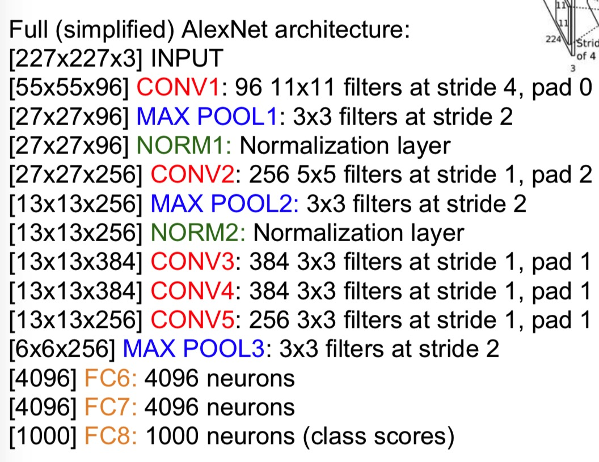

**细节**：

* 第一次使用 ReLU
* 使用 Norm layers
* 数据增强
* dropout 0.5
* Batch size 128
* SGD Momentum 0.9
* 学习率 1e-2, 手动减小10倍如果 val accuracy 停滞
* L2 权重衰减 5e-4
* 7 个 CNN 集成

AlexNet 是第一个 CNN-based winner，而13年冠军 ZFNet是在 AlexNet 基础之上调整了超参数

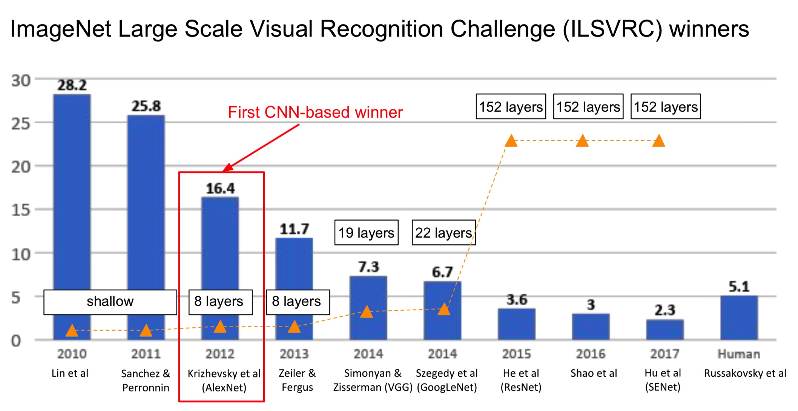

## VGGNet

用**更小的 filter 更深的网络**

从 8层（AlexNet）到16-19 层（VGG16Net）

只有 3x3 CONV stride 1 pad 1和 2x2 MAX POOL stride

使用 VGG top 5 error 从 11.7% 降到了 7.3%

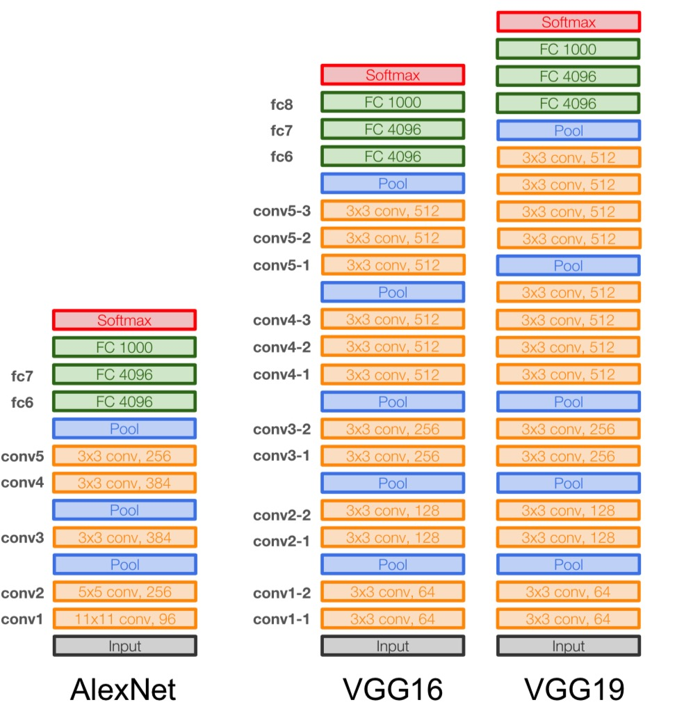

为什么使用更小的 filters?

3个 3x3 conv (stride 1) 的堆叠具有和一个 7x7 cone 相同的有效感受野

而且它具有更多的非线性，更少的参数：$3*(3^2C^2)$ vs $7^2C^2$

前向传播一次：

总内存：约 96 MB / image

总参数：128M 参数

**细节**：

* 使用 VGG16 和 VGG19 效果差不多（VGG19 轻微好一点但是更多内存）
* 使用集成来获得更好的结果
* FC7 的特征对其他任务的泛化性能很好

### GoogLeNet

**更深的网络，计算效率**

使用了 Inception 模块：设计了一个局部网络拓扑

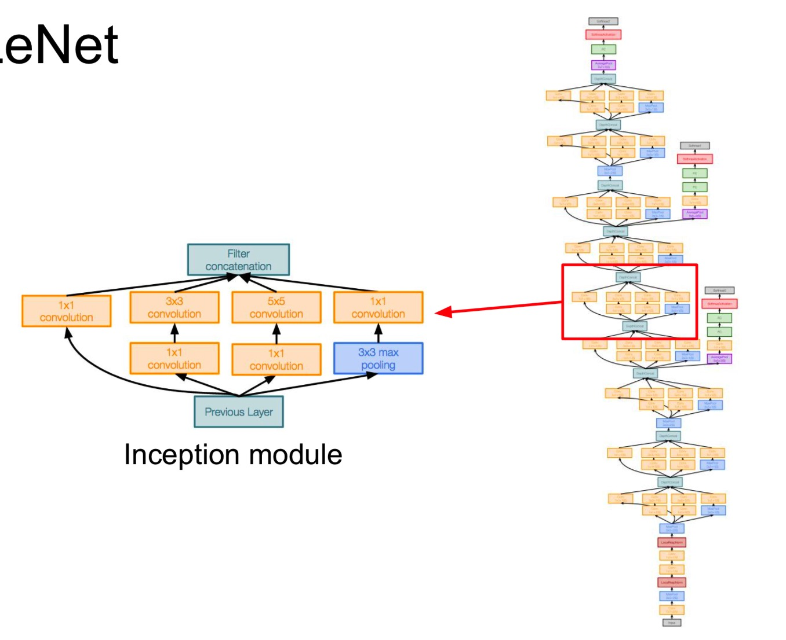

先看一个 Naive Inception 模块

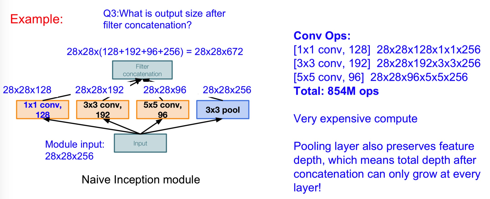

共有多达 854M ops ，这是非常昂贵的计算

解决方案是：“BottleNeck” 层，使用 1x1 的 conv 来减小 特征深度

使用了 BottleNeck 层后减少到了 358M ops

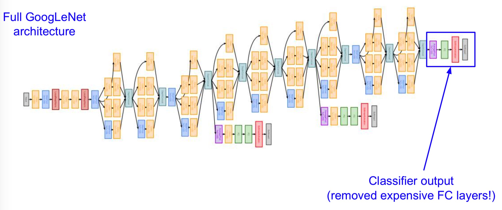

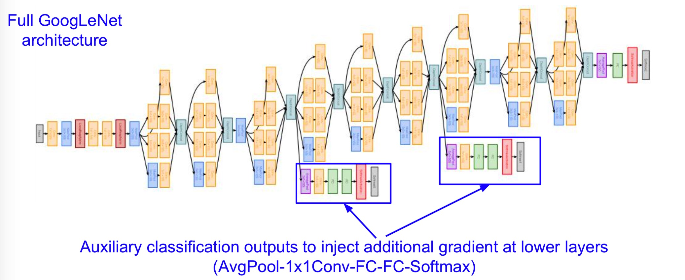

最后移除了昂贵的 FC 层，并且在网络中添加了辅助分类层

**细节**：

* 22层
* 高效的 Inception 模块
* 比 AlexNet 少了 12 倍的参数
* 6.7% top error

### ResNet

**使用残差连接的非常深的网络**

当我们不断增加网络的层数时，会发现不论是训练误差还是测试误差都表现的很差，越深的网络表现的本应该比浅的网络好，但是因为它的难于优化导致了表现的不好。

一个解决方案是复制从浅层学到的层再加上额外的层来进行标识映射

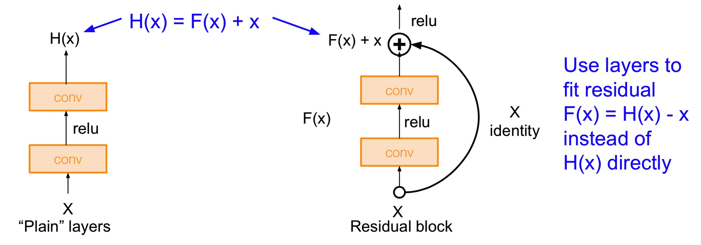

使用残差网络来拟合 残差映射 H(x)-x 而不是原映射

全部的 ResNet 结构：

* 周期性的加倍 filters 的个数，并且使用 stride 2(/2 每个维度)空间下采样
* 最开始有额外的 conv 层
* 最后没有 FC layers（只有FC 1000到输出层）

对于更深的网络（ResNet-50+），使用BoottleNeck 层来提高效率

**细节**：

* 每个 CONV 层后使用 BN
* Xavier 2 初始化
* SGD+Momentum(0.9)
* 学习率：0.1 ，当 validation error 稳定时除以10
* Mini-batch 大小：256
* 权重衰减系数为 1e-5
* 没有使用 dropout

### 比较复杂度

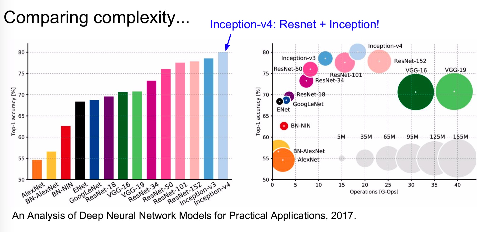

### 改进的 ResNets

1.在 residual 的路径中加入更多的操作层

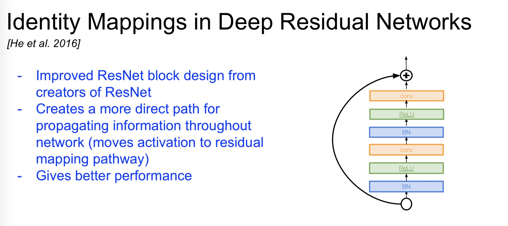

2.更宽的 residual network

3.借鉴了 Inception 的机制

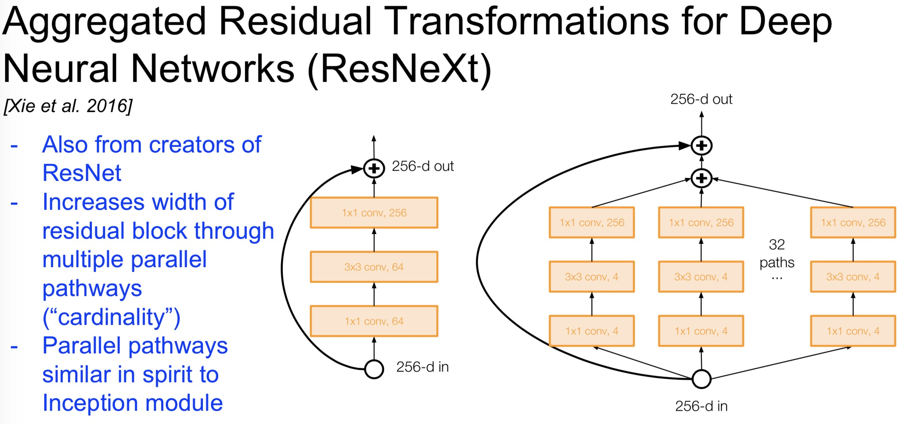

4. SENet 采用特征重标定策略，通过学习的方式获取每个特征通道的重要程度

先是 Squeeze 操作，对每个空间维度进行压缩，将一个二维的特征通道表成一个实数，输出的维度和输入的通道数相同。

然后 Excitation 操作，通过参数 w 来为每个特征通道生成权重。

最后 Reweight 操作，将 Excitation 输出的权重看成是每个特征通道的重要性，然后加权到先前的特征上，完成重标定。

       

### 其他网络

1. SqueezeNet：具有 AlexNet 级别的准确率但是比它少 50 倍的参数和约 0.5Mb 的模型大小

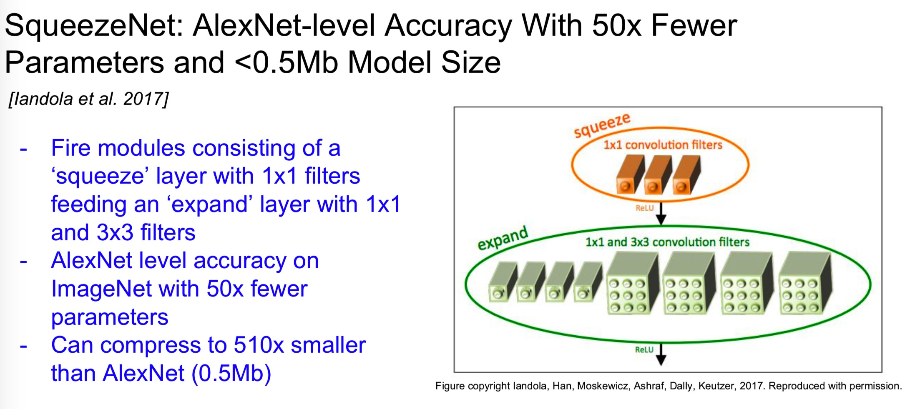

### 总结：

1. VGG,GoogLeNet,ResNet 应用非常广泛
2. ResNet 目前最好，也可以考虑一下 SENet
3. 趋势是越来越深的网络
4. 目前研究专注于层的设计，跳过连接和改善梯度流
5. 研究深度 vs 广度 和 residual 连接的必要性
6. 甚至更多趋势在 meta-learning