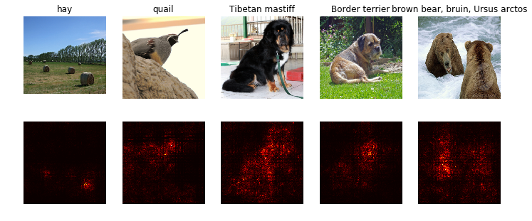
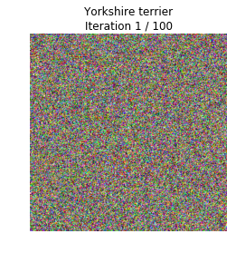

本文来自于 cs231n assignment3 NetworkVisualization这个作业，下面我总结了这个作业的知识点和一些编程技巧。

这个作业介绍了梯度上升法来生成新的图像，在训练模型的时候，我们定义一个损失函数来衡量模型的输出和我们期望之间的差别，也就是衡量模型的表现，表现的越好损失越小，通过反向传播来更新模型参数来减小损失。  
但是这里介绍的方法略微有些不同，我们从一个在 ImageNet 预训练好的用来分类图片的 CNN 开始，我们保持这个模型固定，按照一定规则生成（可能是随机的）图片，定义一个损失函数（或者是得分函数） 将这个图片放入 CNN 中，想要不断通过梯度上升来提高得分函数或者用梯度下降来降低损失函数。


在这个作业里我们探讨三个图像生成的技巧:
1. **显著图 (saliency maps)** 显著图告诉我们图像中的哪些像素对于损失函数的梯度值比较大，也就是对分类影响比较大
2. **欺骗图像 (fooling images)** 我们可以对输入图像进行扰动，让它在人眼看来是 A 类，但是却别模型分为 B 类
3. **类别可视化 (class visualization)** 从0合成一个图像来使得模型把它分类为某一类，以此来观察当模型将某个图片分为某一类时它在寻找什么


```python
import torch
import torchvision
import torchvision.transforms as T
import random
import numpy as np
from scipy.ndimage.filters import gaussian_filter1d
import matplotlib.pyplot as plt
from cs231n.image_utils import SQUEEZENET_MEAN, SQUEEZENET_STD
from PIL import Image

%matplotlib inline
plt.rcParams['figure.figsize'] = (10.0, 8.0) # set default size of plots
plt.rcParams['image.interpolation'] = 'nearest'
plt.rcParams['image.cmap'] = 'gray'
```

因为我们的预训练模型是在减去均值并除以标准差的图像上训练的，所以我们需要对图像进行预处理


```python
def preprocess(img, size=224):
    transform = T.Compose([
        T.Resize(size), # resize to given size 
        T.ToTensor(),  # Convert a PIL Image or numpy.ndarray to tensor.
        T.Normalize(mean=SQUEEZENET_MEAN.tolist(),
                    std=SQUEEZENET_STD.tolist()),
        T.Lambda(lambda x: x[None]), # Apply a user-defined lambda as a transform
    ])
    return transform(img)

def deprocess(img, should_rescale=True):
    transform = T.Compose([
        T.Lambda(lambda x: x[0]),
        T.Normalize(mean=[0, 0, 0], std=(1.0 / SQUEEZENET_STD).tolist()),
        T.Normalize(mean=(-SQUEEZENET_MEAN).tolist(), std=[1, 1, 1]),
        T.Lambda(rescale) if should_rescale else T.Lambda(lambda x: x),
        T.ToPILImage(),  # Convert a tensor or an ndarray to PIL Image.(256,256)
    ]) 
    return transform(img)

def rescale(x):
    low, high = x.min(), x.max()
    x_rescaled = (x - low) / (high - low)
    return x_rescaled
    
def blur_image(X, sigma=1):
    X_np = X.cpu().clone().numpy()
    X_np = gaussian_filter1d(X_np, sigma, axis=2)
    X_np = gaussian_filter1d(X_np, sigma, axis=3)
    X.copy_(torch.Tensor(X_np).type_as(X))
    return X
```

#### 为数组增加维度

第一种方法


```python
a = np.random.randn(2,2)
a
```


    array([[ 0.32945468, -1.3455517 ],
           [ 1.01103541,  0.54276525]])


```python
a = a[None]
a
```


    array([[[ 0.32945468, -1.3455517 ],
            [ 1.01103541,  0.54276525]]])


```python
第二种方法
```


```python
b = np.random.randn(2,2)
b
```


    array([[-1.08899589,  0.3862298 ],
           [-2.05128035, -2.39455455]])


```python
b = b[np.newaxis,:,:]
b
```


    array([[[-1.08899589,  0.3862298 ],
            [-2.05128035, -2.39455455]]])


# 预训练模型

这里用的预训练模型是 SqueezeNet，它具有媲美于 AlexNet 的准确率，但是有更少的参数和计算复杂度，使用 SqueezeNet 而不是 AlexNet 或者 VGG 让我们可以在 CPU 上进行图像生成实验


```python
# Download and load the pretrained SqueezeNet model.
model = torchvision.models.squeezenet1_1(pretrained=True)

# We don't want to train the model, so tell PyTorch not to compute gradients
# with respect to model parameters.
for param in model.parameters():
    param.requires_grad = False
    
# you may see warning regarding initialization deprecated, that's fine, please continue to next steps
```

# 加载一些 ImageNet 图像

这里提供了一些来自 ImageNet ILSVRC 2012 Classification dataset 验证集的训练图像


```python
from cs231n.data_utils import load_imagenet_val
X, y, class_names = load_imagenet_val(num=5)

plt.figure(figsize=(12, 6))
for i in range(5):
    plt.subplot(1, 5, i + 1)
    plt.imshow(X[i])
    plt.title(class_names[y[i]])
    plt.axis('off')
plt.gcf().tight_layout()
```


```python
def load_imagenet_val(num=None):
    """Load a handful of validation images from ImageNet.

    Inputs:
    - num: Number of images to load (max of 25)

    Returns:
    - X: numpy array with shape [num, 224, 224, 3]
    - y: numpy array of integer image labels, shape [num]
    - class_names: dict mapping integer label to class name
    """
    imagenet_fn = 'cs231n/datasets/imagenet_val_25.npz'
    if not os.path.isfile(imagenet_fn):
      print('file %s not found' % imagenet_fn)
      print('Run the following:')
      print('cd cs231n/datasets')
      print('bash get_imagenet_val.sh')
      assert False, 'Need to download imagenet_val_25.npz'
    f = np.load(imagenet_fn)
    X = f['X']
    y = f['y']
    class_names = f['label_map'].item()
    if num is not None:
        X = X[:num]
        y = y[:num]
    return X, y, class_names
```

# 显著图 (Saliency Maps)

显著图告诉我们图像的每个像素对于分类的影响，通过计算每个像素的损失函数的梯度值，在这里我们取的是梯度的绝对值，然后取每个位置三个 channel 上的最大值作为结果，例如一张图像的大小是 `(3,H,W)`，那么我们得到的显著图大小就是 `(H,W)` ，并且每个位置上都是非负数

### Pytorch gather method

在 numpy 中，我们想要从一个矩阵中的每一行按照一定的规则选出一个元素来，比如 `s` 是一个 `(N,C)` 的数组，`y` 是一个 `(N,)` 的数组，其中每个元素 `0 <= y[i] <= C`，那么 `s[np.arange(N), y]` 是一个大小为 `(N,)` 的数组，它的每一个元素都是按照 `s[i,y[i]]` 来选择的

在 pytorch 中，我们可以使用 `gather()` 方法，如果 `s` 是一个大小为 `(N,c)` pytorch tensor, `y` 是一个大小为 `(N,)` 的 pytorch tensor，其中每个元素 `0 <= y[i] <= C`，那么


```python
s.gather(1, y.view(-1, 1)).squeeze()
```

就得到了跟 numpy 中一样的效果，在 `gather()` 中, 第一个位置的参数指的是 axis，第二个参数是规则矩阵，一定要用 `view()` 把它变成 `(N,1)` 的形式，最后再通过 `squeeze()` 把它的 1 维度去掉，也就是将它从 `(N,1)` 变成 `(N,)`


```python
# Example of using gather to select one entry from each row in PyTorch
def gather_example():
    N, C = 4, 5
    s = torch.randn(N, C)
    y = torch.LongTensor([1, 2, 1, 3])
    print(s)
    print(y)
    print(s.gather(1, y.view(-1, 1)).squeeze())
gather_example()
```

    tensor([[-1.3283,  1.2052,  0.0181, -0.4928, -1.3312],
            [-0.2330,  1.2142, -1.5272,  1.2446, -0.5268],
            [ 1.1553,  0.0828,  0.0967, -0.1219,  0.6208],
            [ 0.7668, -0.9621, -0.1157, -1.0897,  0.0830]])
    tensor([1, 2, 1, 3])
    tensor([ 1.2052, -1.5272,  0.0828, -1.0897])


```python
def compute_saliency_maps(X, y, model):
    """
    Compute a class saliency map using the model for images X and labels y.

    Input:
    - X: Input images; Tensor of shape (N, 3, H, W)
    - y: Labels for X; LongTensor of shape (N,)
    - model: A pretrained CNN that will be used to compute the saliency map.

    Returns:
    - saliency: A Tensor of shape (N, H, W) giving the saliency maps for the input
    images.
    """
    # Make sure the model is in "test" mode
    model.eval()
    
    # Make input tensor require gradient
    X.requires_grad_()
    
    saliency = None
    ##############################################################################
    # TODO: Implement this function. Perform a forward and backward pass through #
    # the model to compute the gradient of the correct class score with respect  #
    # to each input image. You first want to compute the loss over the correct   #
    # scores (we'll combine losses across a batch by summing), and then compute  #
    # the gradients with a backward pass.                                        #
    ##############################################################################
    output = model(X)
    criterion = torch.nn.CrossEntropyLoss()
    loss = criterion(output, y)
    loss.backward()
    grads = X.grad.abs()
    saliency = grads.max(dim=1)[0]
    ##############################################################################
    #                             END OF YOUR CODE                               #
    ##############################################################################
    return saliency
```


```python
criterion = torch.nn.CrossEntropyLoss()
# 下面 input 是 (N,c) 的scores, target 的大小是 (N,) ，它们都是 torch.tensor, loss 是一个标量
loss = criterion(input, target)
```

`tensor.max(dim=1)` 指的是在第一维度上取最大值，返回值是一个包含两部分的元组 `(max, max_indices)`


```python
a = torch.randn(4,4)
a
```


    tensor([[-1.0853e+00, -2.0006e-01,  9.3265e-01,  3.6327e-01],
            [-7.7066e-01, -8.4383e-01,  4.9525e-02,  4.4674e-01],
            [ 2.8659e-01,  1.2025e-03, -1.8949e-01,  6.8725e-01],
            [ 1.4925e-01, -2.4102e-01,  1.5316e+00, -2.0074e+00]])


```python
a.max(dim=1)
```


    (tensor([0.9326, 0.4467, 0.6872, 1.5316]), tensor([2, 3, 3, 2]))


然后我们可视化上面提到的样例图的显著图


```python
def show_saliency_maps(X, y):
    # Convert X and y from numpy arrays to Torch Tensors
    X_tensor = torch.cat([preprocess(Image.fromarray(x)) for x in X], dim=0)
    y_tensor = torch.LongTensor(y)

    # Compute saliency maps for images in X
    saliency = compute_saliency_maps(X_tensor, y_tensor, model)

    # Convert the saliency map from Torch Tensor to numpy array and show images
    # and saliency maps together.
    saliency = saliency.numpy()
    N = X.shape[0]
    for i in range(N):
        plt.subplot(2, N, i + 1)
        plt.imshow(X[i])
        plt.axis('off')
        plt.title(class_names[y[i]])
        plt.subplot(2, N, N + i + 1)
        plt.imshow(saliency[i], cmap=plt.cm.hot)
        plt.axis('off')
        plt.gcf().set_size_inches(12, 5)
    plt.show()

show_saliency_maps(X, y)
```


# 欺骗图像 (Fooling Images)

我们可以使用梯度上升（梯度下降也可以）来生成欺骗图像，给定一个图像（属于类 A）和一个目标类 B，我们想让模型判断图像为 B 类，通过梯度上升不断修改图像的像素使得模型将其分类为 B 类的分数越来越高，直到将其分类为 B 类


```python
def make_fooling_image(X, target_y, model):
    """
    Generate a fooling image that is close to X, but that the model classifies
    as target_y.

    Inputs:
    - X: Input image; Tensor of shape (1, 3, 224, 224)
    - target_y: An integer in the range [0, 1000)
    - model: A pretrained CNN

    Returns:
    - X_fooling: An image that is close to X, but that is classifed as target_y
    by the model.
    """
    # Initialize our fooling image to the input image, and make it require gradient
    X_fooling = X.clone()
    X_fooling = X_fooling.requires_grad_()
    
    learning_rate = 1
    ##############################################################################
    # TODO: Generate a fooling image X_fooling that the model will classify as   #
    # the class target_y. You should perform gradient ascent on the score of the #
    # target class, stopping when the model is fooled.                           #
    # When computing an update step, first normalize the gradient:               #
    #   dX = learning_rate * g / ||g||_2                                         #
    #                                                                            #
    # You should write a training loop.                                          #
    #                                                                            #
    # HINT: For most examples, you should be able to generate a fooling image    #
    # in fewer than 100 iterations of gradient ascent.                           #
    # You can print your progress over iterations to check your algorithm.       #
    ##############################################################################
    for i in range(100):
        print("iteration %d" %(i)) 
        X_fooling.requires_grad_()
        output = model(X_fooling)
        if output.data.max(1)[1].item() == target_y:
            break
        '''
        这里也可以用梯度下降法，不过后面的更新规则要改为 X_fooling -= dX
        criterion = torch.nn.CrossEntropyLoss()
        loss = criterion(output, torch.LongTensor([target_y]))
        print(loss.data)
        '''
        scores = output.gather(1, torch.LongTensor([target_y]).view(-1,1)).squeeze().sum()
        scores.backward()
        X_fooling.detach_()
        g = X_fooling.grad
        dX = learning_rate * g / g.norm()
        X_fooling += dX
    ##############################################################################
    #                             END OF YOUR CODE                               #
    ##############################################################################
    return X_fooling
```

在上面的循环中，每次都要把 使用 `detach_()` 将 `X_fooling` 从计算图中分离开来，这样做的原因是，pytorch 不允许你在直接创造的变量上做 in-place operations，比如这里的 `X_fooling += dX`，所以需要将它先从计算图中分离开来，然后再下一步中再重新加入计算图

运行下面的代码来生成一个欺骗图像，第一眼看上去你可能会发现原图像和欺骗图像没有什么区别但是模型却把他们分为不同的类别


```python
idx = 0
target_y = 6

X_tensor = torch.cat([preprocess(Image.fromarray(x)) for x in X], dim=0)
X_fooling = make_fooling_image(X_tensor[idx:idx+1], target_y, model)

scores = model(X_fooling)
assert target_y == scores.data.max(1)[1][0].item(), 'The model is not fooled!'
```

    iteration 0
    iteration 1
    iteration 2
    iteration 3
    iteration 4
    iteration 5
    iteration 6
    iteration 7
    iteration 8
    iteration 9
    iteration 10
    iteration 11
    iteration 12
    iteration 13
    iteration 14
    iteration 15
    iteration 16
    iteration 17
    iteration 18
    iteration 19

```python
X_fooling_np = deprocess(X_fooling.clone())
X_fooling_np = np.asarray(X_fooling_np).astype(np.uint8)

plt.subplot(1, 4, 1)
plt.imshow(X[idx])
plt.title(class_names[y[idx]])
plt.axis('off')

plt.subplot(1, 4, 2)
plt.imshow(X_fooling_np)
plt.title(class_names[target_y])
plt.axis('off')

plt.subplot(1, 4, 3)
X_pre = preprocess(Image.fromarray(X[idx])) #一定将其化为 Image 对象，因为 preprocess中的操作都是对 Image 对象操作的
diff = np.asarray(deprocess(X_fooling - X_pre, should_rescale=False))
plt.imshow(diff)
plt.title('Difference')
plt.axis('off')

plt.subplot(1, 4, 4)
diff = np.asarray(deprocess(10 * (X_fooling - X_pre), should_rescale=False))
plt.imshow(diff)
plt.title('Magnified difference (10x)')
plt.axis('off')

plt.gcf().set_size_inches(12, 5)
plt.show()
```


# 类别可视化

从一个随机噪声图像，对其应用梯度上升来使其不断更新最终让模型将其分类成某一类别

我们定义一个得分函数 `s`, `s` 由两部分组成:

$$
s = s_y(I) - R(I)
$$

$s_y(I)$ 表示的是将图片 I 分类成 y类 的得分，后面还要再减去一个正则化项 $R(I)$，我们想要使这个 $R(I)$ 尽可能大，使 $s_y(I)$ 尽可能小，这里使用的是 L2 正则化

$$
R(I) = \lambda \|I\|_2^2
$$

并且我们还会对生成的图像进行周期的模糊以此来达到更好的效果


```python
def jitter(X, ox, oy):
    """
    Helper function to randomly jitter an image.
    
    Inputs
    - X: PyTorch Tensor of shape (N, C, H, W)
    - ox, oy: Integers giving number of pixels to jitter along W and H axes
    
    Returns: A new PyTorch Tensor of shape (N, C, H, W)
    """
    if ox != 0:
        left = X[:, :, :, :-ox]
        right = X[:, :, :, -ox:]
        X = torch.cat([right, left], dim=3)
    if oy != 0:
        top = X[:, :, :-oy]
        bottom = X[:, :, -oy:]
        X = torch.cat([bottom, top], dim=2)
    return X
```


```python
def create_class_visualization(target_y, model, dtype, **kwargs):
    """
    Generate an image to maximize the score of target_y under a pretrained model.
    
    Inputs:
    - target_y: Integer in the range [0, 1000) giving the index of the class
    - model: A pretrained CNN that will be used to generate the image
    - dtype: Torch datatype to use for computations
    
    Keyword arguments:
    - l2_reg: Strength of L2 regularization on the image
    - learning_rate: How big of a step to take
    - num_iterations: How many iterations to use
    - blur_every: How often to blur the image as an implicit regularizer
    - max_jitter: How much to gjitter the image as an implicit regularizer
    - show_every: How often to show the intermediate result
    """
    model.type(dtype)
    l2_reg = kwargs.pop('l2_reg', 1e-3)
    learning_rate = kwargs.pop('learning_rate', 25)
    num_iterations = kwargs.pop('num_iterations', 100)
    blur_every = kwargs.pop('blur_every', 10)
    max_jitter = kwargs.pop('max_jitter', 16)
    show_every = kwargs.pop('show_every', 25)

    # Randomly initialize the image as a PyTorch Tensor, and make it requires gradient.
    img = torch.randn(1, 3, 224, 224).mul_(1.0).type(dtype).requires_grad_()

    for t in range(num_iterations):
        # Randomly jitter the image a bit; this gives slightly nicer results
        ox, oy = random.randint(0, max_jitter), random.randint(0, max_jitter)
        img.data.copy_(jitter(img.data, ox, oy))

        ########################################################################
        # TODO: Use the model to compute the gradient of the score for the     #
        # class target_y with respect to the pixels of the image, and make a   #
        # gradient step on the image using the learning rate. Don't forget the #
        # L2 regularization term!                                              #
        # Be very careful about the signs of elements in your code.            #
        ########################################################################
        img.requires_grad_()
        output = model(img)
        score = output.squeeze()[target_y] - l2_reg * (img.norm()**2)
        score.backward()
        img.detach_()
        grad = img.grad
        img = img + learning_rate * grad / grad.norm()
        ########################################################################
        #                             END OF YOUR CODE                         #
        ########################################################################
        
        # Undo the random jitter
        img.data.copy_(jitter(img.data, -ox, -oy))

        # As regularizer, clamp and periodically blur the image
        for c in range(3):
            lo = float(-SQUEEZENET_MEAN[c] / SQUEEZENET_STD[c])  #在原图像像素为 0 
            hi = float((1.0 - SQUEEZENET_MEAN[c]) / SQUEEZENET_STD[c]) # 在原图像中像素为 1
            img.data[:, c].clamp_(min=lo, max=hi)
        if t % blur_every == 0:
            blur_image(img.data, sigma=0.5)
        
        # Periodically show the image
        if t == 0 or (t + 1) % show_every == 0 or t == num_iterations - 1:
            plt.imshow(deprocess(img.data.clone().cpu()))
            class_name = class_names[target_y]
            plt.title('%s\nIteration %d / %d' % (class_name, t + 1, num_iterations))
            plt.gcf().set_size_inches(4, 4)
            plt.axis('off')
            plt.show()

    return deprocess(img.data.cpu())
```

下面我们来生成 约克训犬


```python
dtype = torch.FloatTensor
# dtype = torch.cuda.FloatTensor # Uncomment this to use GPU
model.type(dtype)

# target_y = 76 # Tarantula
# target_y = 78 # Tick
target_y = 187 # Yorkshire Terrier
# target_y = 683 # Oboe
# target_y = 366 # Gorilla
# target_y = 604 # Hourglass
out = create_class_visualization(target_y, model, dtype)
```




