本文总结了 cs231n lecture11 的知识点，介绍了计算机视觉的一些方向：

* 语义分割：upsampling downsampling
* 图像分类和定位
* 多目标检测: RCNN Fast-RCNN Faster-RCNN YOLO
* 3d 物体检测
* 实例分隔：Mask-RCNN

现在的图像识别大部分是由卷积——全连接——softmax概率组成

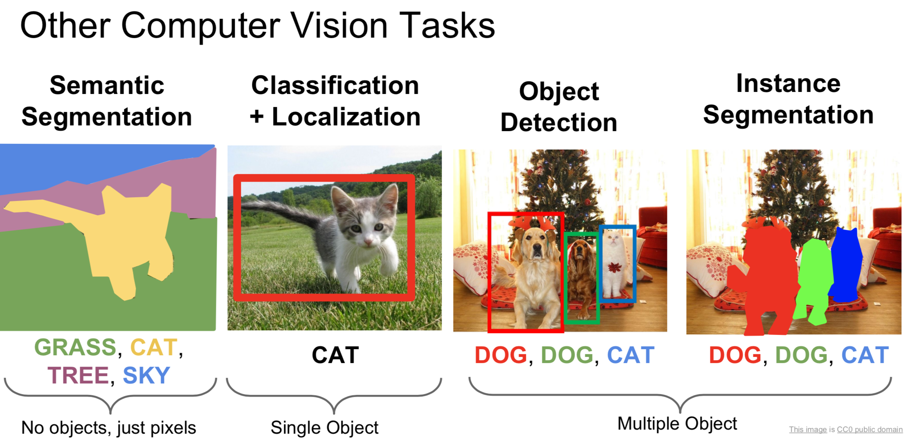

其他的一些计算机视觉的任务：语义分割，分类+定位，目标检测，实例分割

### 语义分割 

为每个像素产生一个分类标签，但是它不会区分同类目标，只关系像素，这是语义分割的一些不足

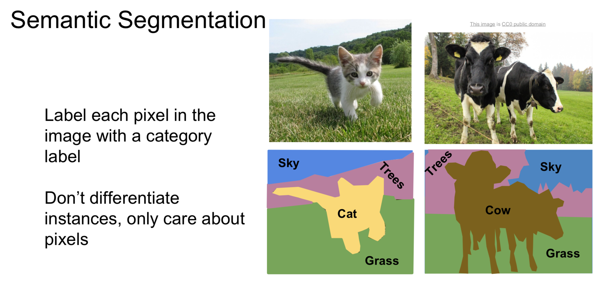

用CNN训练，一次预测所有的pixels，这需要事先给定一些类别，然后计算每个像素的每个类别的概率，然后用交叉熵来计算损失。但是这样卷积计算量很大，因为每次卷积得到的都是 `HxW` 维的，最后得到的 `scores` 也是 `CxHxW` 维的，这与一般的CNN识别物体 不同，一般的CNN 是在卷积的过程中不断减小卷机的维度，最后映射到 FC 层。

改进方法是，在前半段网络，就像图片分类里面不断卷积和下采样，在后半部分网络通过Upsampling增加清晰度，但是要怎样Upsampling呢？

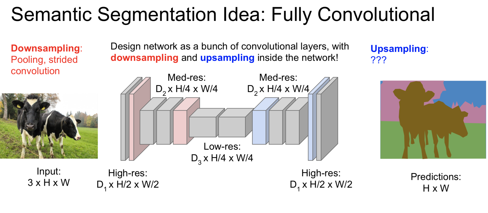

一些Upsampling(也叫Unpooling)方法：

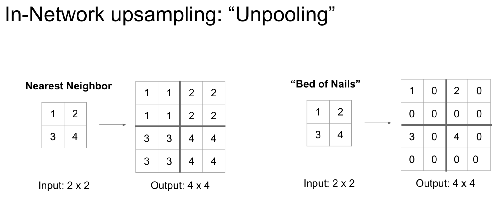

在网络中，每个downsampling都有一个对应的Upsampling存在，对于max pooling，我们通常记住downsampling时最大的那个pixel的位置，然后在对应的Upsampling中根据这些位置来max unpooling

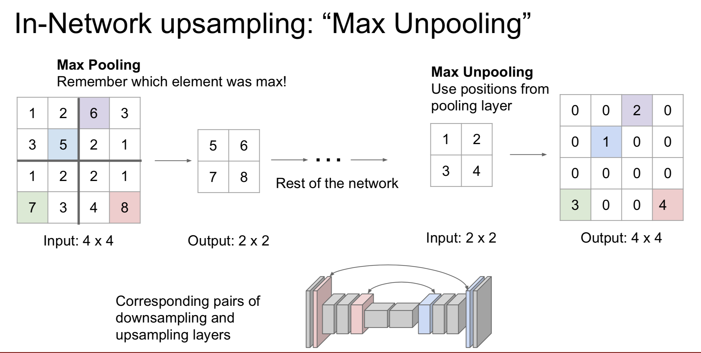

上面的都是不可学习的Upsampling，它没有要学习的权重，下面是一个可以学习的Upsampling，我们可以控制权重和步长

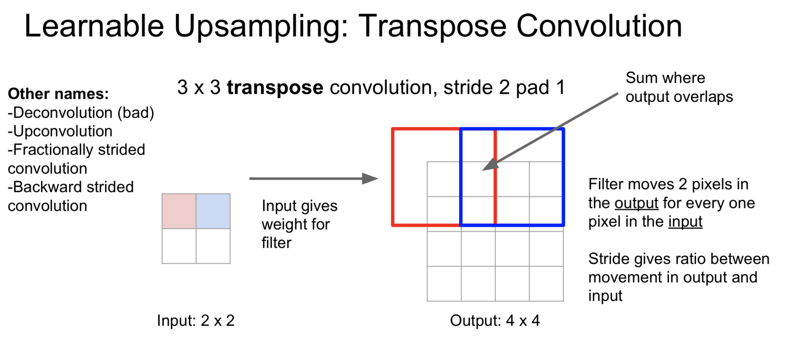

为什么叫它为Transpose Convolution?这个名字有点tricky，下面是一个Upsampling的例子

对于卷积我们可以把它考虑成矩阵乘法，而在上面的Upsampling我们也可以把它考虑成一个矩阵乘法，而这个权重矩阵就是先前那个卷积的权重矩阵的转置，Transpose Convolution名字由此而来，然而必须要注意的是这只对stride=1成立

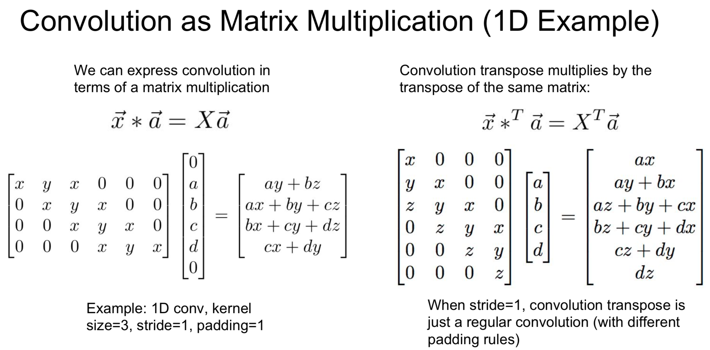

### 图像分类和定位

与单独只有分类的CNN不同，加上定位的CNN会在网络中计算两个损失，一个是分类的损失(softmax loss)一个是定位的损失(L2 loss)，但会有个问题是如何权衡这两个损失，这需要一些经验。

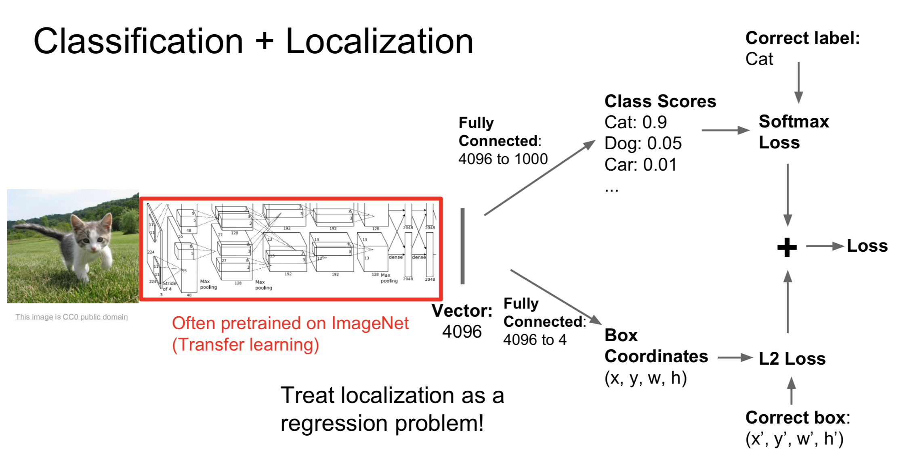

在人体仪态识别中，我们就可以固定14个节点关节，训练网络输出每个对应的节点关节的位置从而达到仪态识别的目的

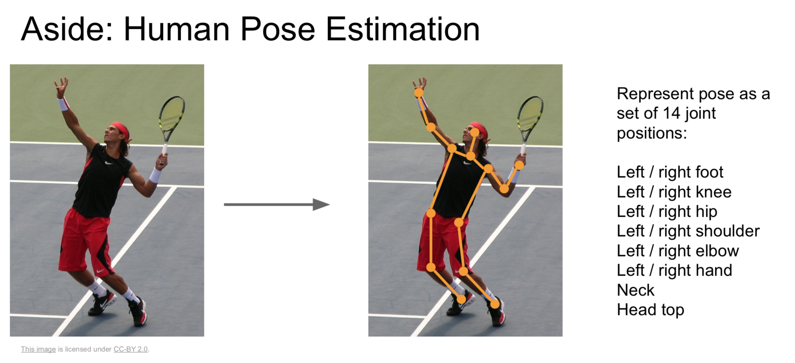

### 目标检测

与分类+定位不同的是，目标检测可能会有多个object

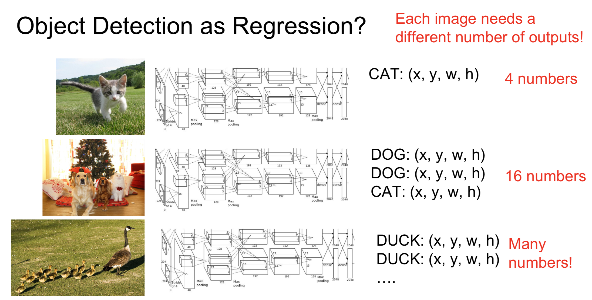

一种方法是采用sliding window，对每一个crop应用CNN，然后分类它是object还是background，但是这样计算量相当大。

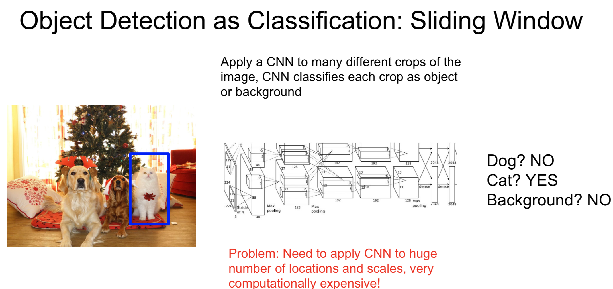

改进方法是，之前我们是任意划分crop这样需要对每个划分的crop都要CNN一遍，里面有很多没有用的crop，我们可以基于一些traditional algrithom来找到一些regions of interest(ROI)，也就是可能会有object的区域，这些算法通常是固定的。然后我们基于这些ROI应用CNN。比如下面的 region proposals/ selective search

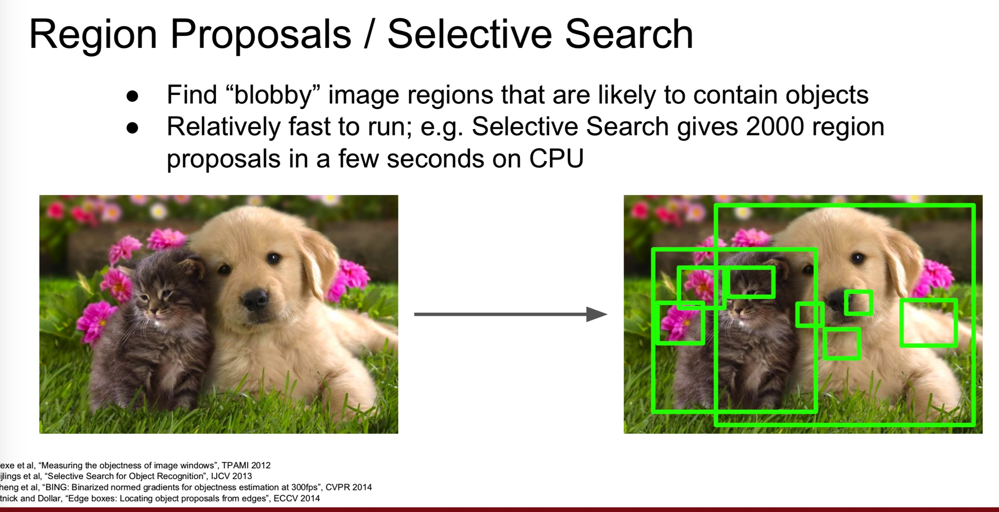

但是这些ROI的大小可能都是不一样的，为了方便下游CNN处理，我们需要将它们转换成同样的大小，然后放进CNN。

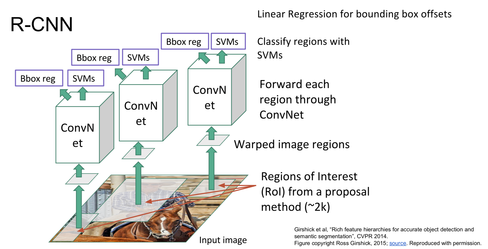

在R-CNN中正是运用了这种想法，在最后一层它用SVM来分类，除此之外它还有一个bounding box offsets的回归损失，因为在ROI中区域划分不可能非常精确，有时候需要一些偏移，通过这个Bbox reg来学习这个偏移量。

但是R-CNN仍然很慢，它需要划分大概2000个ROI。

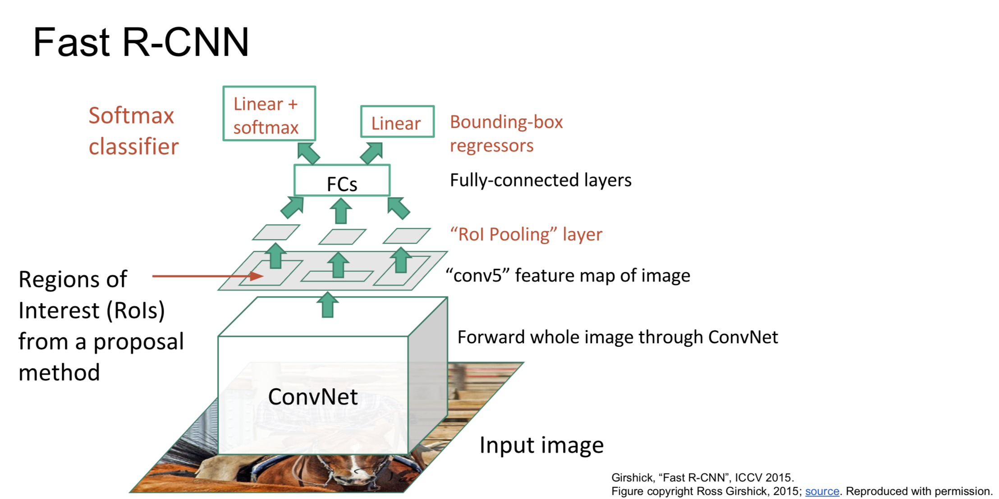

Fast R-CNN是一个改进方法，它先将整个图像放进一个卷积网络里然后输出一个feature map，然后对这个feature map作划分找到ROI，然后用ROI Pooling将他们转换到同一大小进行训练。然后将feature map里的ROI映射回原来图像上的位置。这样速度提升很多但是找ROI仍是一个非常耗时的工作。

这里的损失依然是两个损失：一个是 softmax 分类的损失，还有一个是 bounding-box 的损失。

我有个问题是它是如何权衡分类误差和框选误差的，可能有一个超参数来平衡，它可能把包含object的区域都处理为正确的分类，然后根据框选误差来优化得到较为准确的区域。

还有个问题它是如何根据feature map里的训练结果找到原图像的object的位置的，它在训练的过程中应该是保存了这些映射的过程，然后最后可以再映射回去。

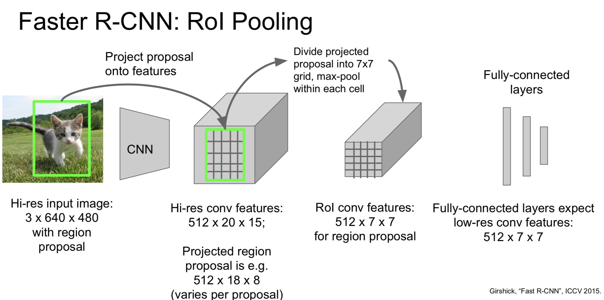

改进方法是Faster R-CNN，让CNN自己做预测来找到ROI，它增加了一个Region Proposal Network(RPN)，其中训练了4个损失：

* RPN 分类 物体/非物体
* RPN 回归标定框的坐标
* 最终分类的分数
* 最终标定框的坐标

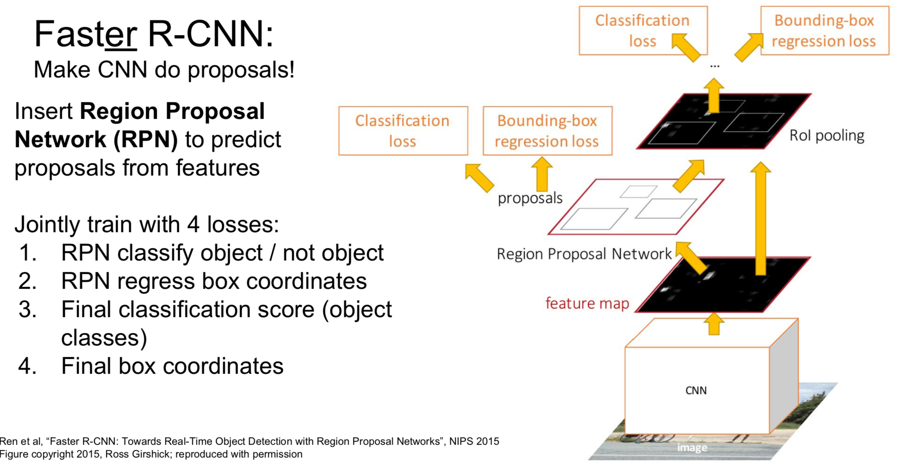

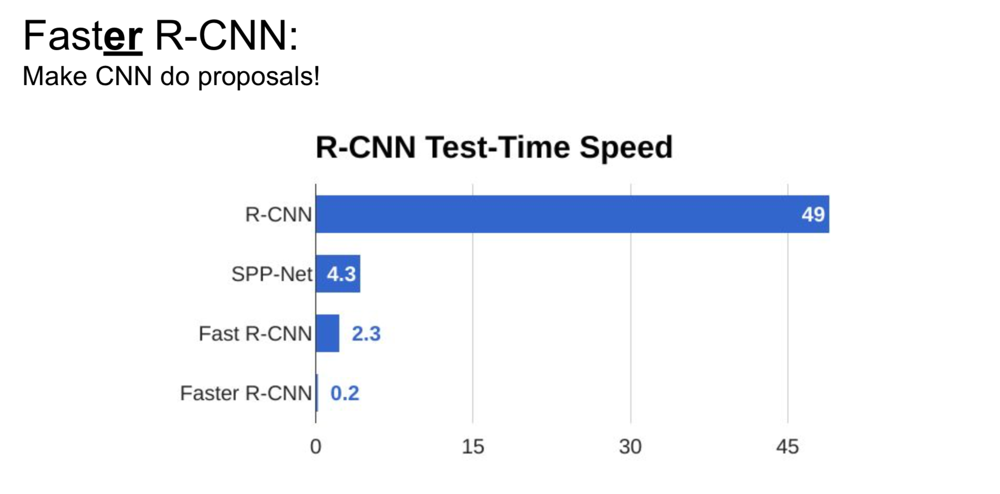

然而还有一种detection without proposals的方法：YOLO(you only look once),SSD(single shot detection)

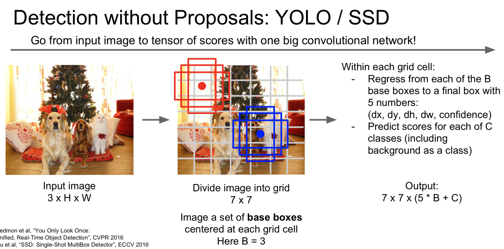

SSD就是将整个图像细分成NxN份，然后对每一份应用B个base boxes，预测这些base boxes的分类，xydw偏移量和置信度。然而这个似乎计算量也非常大啊，为什么速度会比之前的sliding window要快很多呢，可能因为这个每一份划分的都非常小吧，但是划分的很小的话怎么对大物体进行检测呢，这个没有讲清楚，需要进一步阅读论文。

SSD虽然很快但是它没有Faster R-CNN精确。

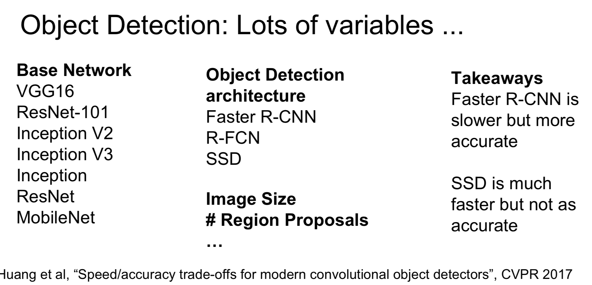

还有两篇比较有趣的论文：

* 物体识别+描述

* 可视化基因组：

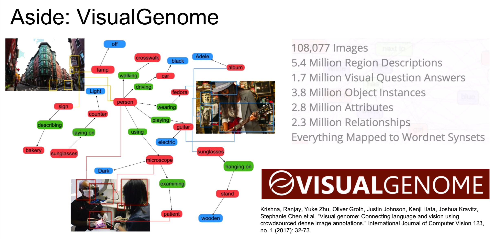

### 3D 物体检测

在自动驾驶中需要大量的用到3D 物体检测，与2D 物体检测的标定框只有四个变量 (x,y,w,h) 不同，3D 物体检测的标定框有(x,y,z,w,h,I,r,p,y) 九个变量，这比 2D 物体检测难多了

[无人驾驶技术介绍的一个视频链接](http://www.youtube.com/watch?v=tiwVMrTLUWg&t=545)

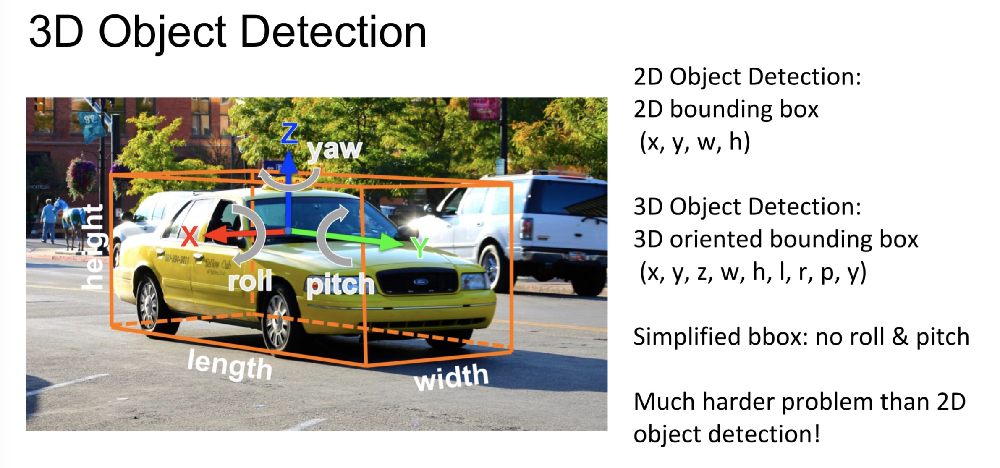

第一种介绍的方法是：使用单目摄像头，与 Faster RCNN 是一个思路，但是预测是 3D 的

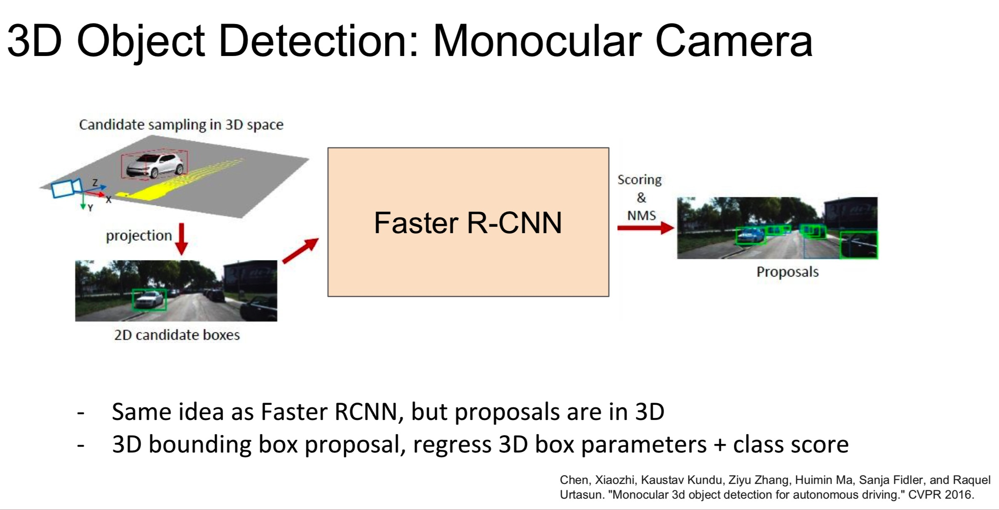

第二种是：使用摄像头和 LiDAR（具体细节还需阅读论文）

### 实例分割

相当于先对图像做Faster R-CNN得到每个object的框框，然后对每个框框再进行semantic segmentation

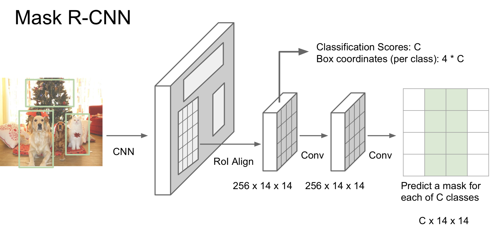

可以看到它的效果非常好,它同样也可以用来做pose estimation

